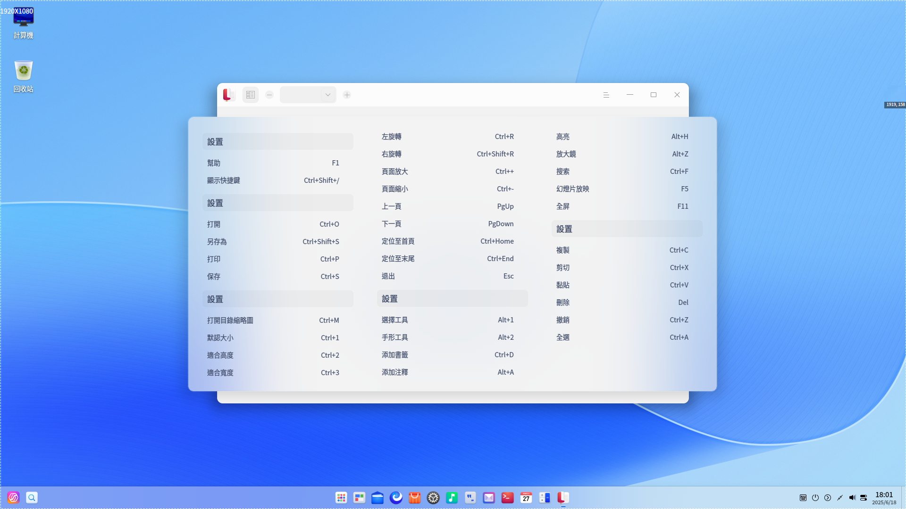

# 文檔查看器|deepin-reader|

## 概述

文檔查看器是系統自帶的文檔查看軟件。不僅可以打開、查看文件，還可以對文檔進行添加書籤、添加注釋以及對選擇的文本進行高亮顯示等操作。

## 使用入門

通過以下方式運行或關閉文檔查看器，或者創建文檔查看器的快捷方式。

### 運行文檔查看器

1. 單擊任務欄上的啟動器圖標 ，進入啟動器界面。
2. 上下滾動鼠標滾輪瀏覽或通過搜索，找到文檔查看器圖標 ，單擊運行。
3. 右鍵單擊 ，您可以：

 - 單擊 **傳送到桌面**，在桌面創建快捷方式。
 - 單擊 **傳送到任務欄**，將應用程序固定到任務欄。
 - 單擊 **加至開機啟動**，將應用程序添加到開機啟動項，在電腦開機時自動運行該應用。

   

### 關閉文檔查看器

- 在文檔查看器界面單擊 ，關閉文檔查看器。
- 在任務欄右鍵單擊 ，選擇 **關閉所有**，關閉文檔查看器。
- 在文檔查看器界面單擊 ，選擇 **退出**，關閉文檔查看器。

### 查看快捷鍵

在文檔查看器界面，使用快捷鍵 **Ctrl + Shift + ?** 打開快捷鍵預覽界面。熟練地使用快捷鍵，將大大提升您的操作效率。

## 基本功能

文檔查看器具備基本的文件管理功能，可以執行打開、保存、打印文件，管理標籤頁、書籤、注釋等操作。

### 打開文件

文檔查看器支持查看PDF、DJVU和DOCX格式的文件，您可以採用以下方式打開文件。

- 直接將文件拖拽到界面或其圖標上。
- 右鍵單擊文件，選擇 **打開方式 > 文檔查看器**。將文檔查看器設為默認打開程序後，可以直接雙擊打開。
- 在文檔查看器初始界面，單擊 **選擇文件**。
- 在文檔查看器界面，使用快捷鍵 **Ctrl + O**，選擇文件打開。

### 保存文件

對當前正在編輯、修改的文檔進行保存。

- 單擊  > **保存** 或使用快捷鍵 **Ctrl + S** 保存文件。
- 單擊  > **另存為** 或使用快捷鍵 **Ctrl + Shift + S** 另存文件。

### 打印文件

在文檔查看器中使用打印，需要您連接並配置好打印機。

1. 在文檔查看器中打開一個文檔，在文檔界面單擊鼠標右鍵選擇 **打印**，也可以使用快捷鍵 **Ctrl + P** 打開打印預覽。
2. 在打印預覽界面，您可以預覽文件，選擇打印機並設置打印頁面。
3. 在打印預覽界面，單擊 **進階**，可配置紙張大小、打印方式等相關參數。
4. 單擊 **打印** 即可將文件發送到打印機打印。

### 管理標籤頁

新增標籤頁

- 單擊  > **新標籤頁**，新增一個標籤頁。
- 當標籤頁達兩個或兩個以上時，可單擊按鈕 ，添加新標籤頁。

切換/調整標籤頁

- 同一窗口內拖拽標籤頁調整排序。
- 當標籤頁過多時會顯示按鈕  或 ，單擊可左右移動。
- 滾動鼠標切換標籤頁。 

窗口間的操作

- 拖拽標籤頁移出當前窗口，創建一個新的窗口。
- 拖拽標籤頁從一個窗口到另一個窗口中。

### 管理書籤

在文檔查看器界面，打開一個文檔。

- 添加書籤
   - 右鍵單擊文檔查看器中的文件頁，選擇 **添加書籤**，為當前正在瀏覽的頁面添加書籤。
   - 將鼠標移至瀏覽頁面右上角書籤區域，顯示圖標 ，單擊書籤圖標為當前頁添加書籤，書籤圖標變為藍色填充的圖標 。
- 刪除書籤：
   - 在已添加書籤的頁面，單擊鼠標右鍵，選擇 **刪除書籤**，刪除當前頁的書籤。
   - 在已添加書籤的頁面，單擊書籤圖標 ，刪除當前頁的書籤。

   > 說明：鼠標移到書籤位置附近才會顯示書籤圖標。鼠標移出書籤區域，書籤圖標消失。當添加書籤後，該圖標一直顯示。

### 管理注釋

在文檔查看器界面，打開一個文檔。

- 添加注釋
   - 使用選擇工具選擇文本內容，單擊鼠標右鍵，選擇 **添加注釋**，完成注釋後被選中的文本內容被高亮顯示。
   - 在文檔空白處或者需要添加注釋的地方，單擊鼠標右鍵，選擇 **添加注釋**，完成注釋後該處會顯示一個高亮的注釋圖標。

   > 說明：如果注釋窗口不輸入內容，直接單擊其他區域，則添加注釋不成功或該條注釋自動刪除。輸入文本內容後，單擊其他區域，注釋內容自動保存。

- 複製注釋
   + 在頁面上，右鍵單擊已添加注釋的文本內容，選擇 **複製**，複製該條注釋的全部內容。
   + 在頁面上，右鍵單擊注釋圖標，選擇 **複製**，複製該條注釋的全部內容。
   + 單擊圖標  打開左側工具欄，在工具欄下方單擊圖標  打開注釋目錄，右鍵單擊某一個注釋，選擇 **複製**，複製該條注釋的全部內容。

- 顯示注釋  
   1.  將鼠標懸停至注釋圖標上，在出現的浮框中顯示部分注釋內容。
   2.  單擊注釋圖標，彈出注釋窗口，可以查看、重新編輯注釋內容。

- 刪除注釋
   + 右鍵單擊已添加注釋的高亮文本內容，選擇 **取消高亮**，刪除該條注釋內容。
   + 右鍵單擊注釋圖標，選擇 **刪除注釋**，刪除該條注釋內容。
   + 單擊圖標  打開左側工具欄，在工具欄下方單擊圖標  打開注釋目錄，右鍵單擊某一個注釋，選擇 **刪除注釋**，刪除該條注釋內容，對應頁面上的這條注釋也會被刪除。

   > 說明：
   > + 支持在當前頁移動注釋圖標。
   > + DJVU格式的文件不支持添加注釋。

## 常用操作

文檔查看器具備很多特色功能，這些功能都是為了讓文件管理更加簡單、高效。

### 搜索

1. 在文檔查看器界面，打開一個文檔。
2. 在文檔頁面單擊鼠標右鍵，選擇 **搜索** 或使用快捷鍵 **Ctrl + F** 打開搜索窗口。
3. 在搜索框中，單擊 ，輸入關鍵字。
4. 按下鍵盤上的 **Enter** 鍵進行搜索。
   - 當搜索到匹配的訊息時，側邊欄會顯示全部搜索結果，文檔中會高亮顯示匹配項。
   - 當沒有搜索到匹配的訊息時，側邊欄會顯示「無搜索結果」。
5.  當搜索到匹配訊息後，單擊按鈕  或  可逐個查找上一個或下一個匹配項。
6. 單擊某條搜索結果，跳轉到對應頁面，該頁面的搜索結果高亮顯示。   
   
   > 注意：不可搜索文檔中由文本轉換成圖片的內容。
7.  清除搜索框中的訊息，即可清除搜索結果。   
   
   > 說明：DJVU格式的文件不支持搜索功能。

### 快速翻頁

使用下列方法之一快速翻頁：

- 在右鍵菜單中選擇  **前一頁** 或 **後一頁** 。
- 如果想直接瀏覽文檔的開頭或結尾，可在右鍵菜單中選擇 **第一頁** 或 **最後一頁**。
- 按下鍵盤上的  或  鍵。
- 在側邊欄縮略圖目錄下，輸入頁碼數後按下 **Enter** 鍵。

### 切換目錄

通過縮略圖可以進行文檔縮略圖目錄 、文檔目錄  、書籤目錄 、注釋目錄  的切換。手動拖拽目錄邊框，縮略圖跟隨可拖拽寬度大小的變化而變化。

### 全屏

1. 在文檔查看器界面，單擊鼠標右鍵選擇 **全屏** 或使用快捷鍵 **F11**，文檔將以全屏形式展示。
2. 將鼠標移到窗口頂部或者左側區域，呼出頂部工具列或側邊工具列；將鼠標移出區域外，工具列自動隱藏。
3. 在全屏狀態下，呼出頂部工具列後單擊縮略圖 ，側邊工具列會一直顯示。
4. 按下鍵盤上的 **Esc** 鍵或使用快捷鍵 **F11** 退出全屏。

### 幻燈片放映

1. 在文檔查看器界面，單擊鼠標右鍵選擇 **幻燈片放映**，文檔頁面將以幻燈片形式進行播放。
3. 單擊  或  切換文檔頁面，也可以單擊  停止播放。
4. 按下鍵盤上的 **Esc** 鍵退出播放。

### 放大和縮小

在文檔查看器界面，使用下列方法之一放大或縮小頁面：

- 按下鍵盤上的 **Ctrl** + 「+」 或 **Ctrl** + 「-」 。
- 按下鍵盤上的 **Ctrl** 鍵，同時按住鼠標中鍵向上或向下滑動。
- 在標題欄中單擊 **+** 放大或單擊 **-** 縮小 。
- 在標題欄中手動輸入縮略比例，或者在下拉框選擇縮略比例，文檔跟着比例依次放大縮小。

### 調整頁面視圖

在標題欄縮放比例下拉框中，您可以：

- 單擊 **雙頁顯示**，進入雙頁顯示模式。
- 單擊 **默認大小**，頁面以100%比例顯示。
- 單擊 **適合頁面**，當前窗口顯示整頁。
- 單擊 **適應高度**，頁面高度在視窗內全部顯示。
- 單擊 **適應寬度**，頁面寬度在視窗內全部顯示。  

### 設置高亮

1. 在文檔查看器界面選中文本，單擊鼠標右鍵選擇 **高亮**，此時有不同的高亮顏色可供選擇。 

2. 選定一種顏色，被選中的文本內容將以該顏色為底紋高亮顯示。
3. 選中已經高亮顯示的文本，單擊 **取消高亮**，可以刪除文字高亮顯示效果。

> 說明：
> - 當再次高亮文本時，可右鍵直接選擇 **高亮**，默認使用您上次選擇的高亮顏色。
> - DJVU格式的文件不支持高亮設置。

### 旋轉

1. 在文檔查看器界面，打開一個文件。
2. 單擊鼠標右鍵選擇 **左旋轉** 或 **右旋轉**，頁面全部同時向左或向右旋轉90°。

### 查看文檔訊息

1. 在文檔查看器界面，打開一個文件。
2. 單擊鼠標右鍵選擇 **文檔訊息**，展示文檔的基本訊息。

## 主菜單

在主菜單中，您可以新建窗口、新建標籤頁、[保存文件](#保存文件)、[搜索文件](#搜索)、[打印文件](#打印文件)、切換窗口主題、查看幫助手冊，了解文檔查看器的更多信息。

### 在檔案管理員中顯示

1. 在文檔查看器界面，單擊 。
2. 選擇 **在檔案管理員中顯示**，定位該文件的存儲位置。

### 放大鏡

1. 在文檔查看器界面，單擊 
2. 選擇 **放大鏡**，將鼠標移動到頁面需要查看的區域，則該區域內容放大。
4. 按下鍵盤上的 **Esc** 鍵或右鍵單擊，即可取消放大鏡功能。

### 切換工具

1. 在文檔查看器界面，單擊  。
2. 選擇 **工具**，支持兩種工具切換。
   - **選擇工具** 支持選擇文本內容。
   - **手形工具** 支持在文檔中移動。

### 主題

窗口主題包含淺色主題、深色主題和系統主題。

1. 在文檔查看器界面，單擊 。
2. 選擇 **主題**，選擇一個主題顏色。

### 幫助

查看幫助手冊，進一步了解和使用文檔查看器。

1. 在文檔查看器界面，單擊 。
2. 選擇 **幫助**。
3. 查看文檔查看器的幫助手冊。

### 關於

1. 在文檔查看器界面，單擊 。
2. 選擇 **關於**。
3. 查看文檔查看器的版本和介紹。

### 退出

1. 在文檔查看器界面，單擊 。
2. 選擇 **退出**。

