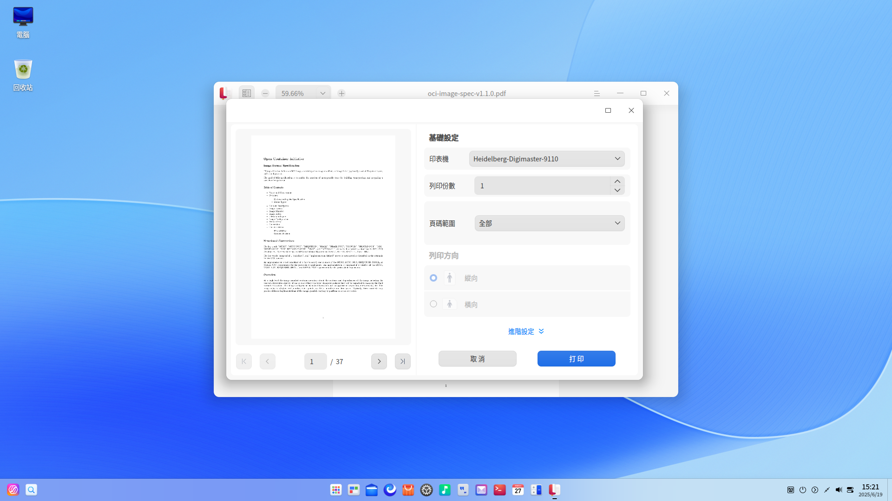

# 文件查看器|deepin-reader|

## 概述

文件查看器是系統自帶的文件查看軟體。不僅可以打開、查看文件，還可以對文件進行添加書籤、添加注釋以及對選擇的文字進行突顯顯示等操作。

## 使用入門

透過以下方式執行或關閉文件查看器，或者建立文件查看器的捷徑。

### 執行文件查看器

1. 單擊桌面底部的 ，進入啟動器介面。
2. 上下滾動滑鼠滾輪瀏覽或透過搜尋，找到文件查看器 單擊執行。
3. 右鍵單擊 ，您可以：

 - 單擊 **建立桌面捷徑**，在桌面建立捷徑。
 - 單擊 **釘選到Dock**，將應用程式固定到Dock。
 - 單擊 **開機啟動**，將應用程式添加到開機啟動項，在電腦開機時自動執行該應用。

   

### 關閉文件查看器

- 在文件查看器介面單擊 ，關閉文件查看器。
- 在任務欄右鍵單擊 ，選擇 **全部關閉** 來關閉文件查看器。
- 在文件查看器介面單擊 ，選擇 **退出** 來關閉文件查看器。

### 查看快捷鍵

在文件查看器介面上，按下鍵盤上的 **Ctrl + Shift + ?** 組合鍵來查看快捷鍵，熟練地使用快捷鍵，將大大提升您的操作效率。

## 基本功能

文件查看器具備基本的文件管理功能，可以執行開啟、儲存、列印文件，管理分頁、書籤、注釋等操作。

### 開啟文件

文件查看器支援查看PDF、DJVU和DOCX格式的文件，您可以採用以下方式開啟文件。

- 直接將文件拖曳到介面或其圖示上。
- 右鍵單擊文件，選擇 **用其他程式開啟 > 文件查看器**。將文件查看器設為預設開啟程式後，可以直接雙擊打開。
- 在文件查看器初始介面，單擊 **選擇文件**。
- 在文件查看器介面，使用快捷鍵 **Ctrl + O**，選擇文件開啟。

### 儲存文件

對目前正在編輯、修改的文件進行儲存。

- 單擊  > **儲存** 或 **Ctrl + S** 組合鍵儲存文件。
- 單擊  > **另存為** 或 **Ctrl + Shift + S** ，另存文件。

### 列印文件

在文件查看器中使用列印，需要您連接並配置好印表機。

1. 在文件查看器中打開一個文件，在文件介面單擊滑鼠右鍵選擇 **列印**，也可以使用組合鍵 **Ctrl + P** 打開列印預覽。
2. 在列印預覽介面，您可以預覽文件，選擇印表機並設定列印頁面。
3. 在列印預覽介面，單擊 **進階設定**，可配置紙張大小、列印方式等相關參數。
4. 單擊 **列印** 即可將文件發送到印表機列印。

### 管理分頁

新增分頁

- 單擊  > **新分頁**，新增一個分頁。
- 當分頁達兩個或兩個以上時，單擊  按鈕添加新分頁。

切換/調整分頁

- 支援在同一視窗內拖曳調整分頁排序。
- 當分頁過多時會顯示  或  按鈕，單擊可左右移動。
- 滾動滑鼠切換分頁。 

視窗間的操作

- 支援拖曳分頁移出目前視窗，建立一個新的視窗。
- 支援拖曳一個分頁從一個視窗移動到另外一個視窗中。

### 管理書籤

在文件查看器介面，開啟一個文件。

- 添加書籤
   - 右鍵單擊文件查看器中的文件頁，選擇 **添加書籤**，可以為目前正在瀏覽的頁面添加書籤。
   - 將滑鼠移至瀏覽頁面右上角書籤區域顯示 ，單擊書籤圖示為目前頁添加書籤，書籤圖示變為藍色填充色。
- 刪除書籤：
   - 在已添加書籤的頁面，右鍵單擊書籤，選擇 **刪除書籤** 來刪除書籤。
   - 滑鼠移到書籤位置, 單擊有填充顏色的書籤圖示，可以取消(刪除)該書籤。

   > 說明：滑鼠移到書籤位置附近才會顯示書籤圖示。滑鼠移出書籤區域，書籤圖示消失。當添加書籤後，該圖示一直顯示。

### 管理注釋

在文件查看器介面，開啟一個文件。

- 添加注釋

   + 使用選擇工具選擇一段文字內容，單擊滑鼠右鍵選擇 **添加注釋**，完成注釋後被選中的文字內容會被突顯顯示。
   + 在文件空白處或者需要添加注釋的地方，單擊滑鼠右鍵選擇 **添加注釋**，完成注釋後該處會顯示一個突顯注釋圖示。

   > 說明：如果注釋視窗不輸入內容，直接單擊其他區域，則添加注釋不成功或該條注釋自動刪除。輸入文字內容後，單擊其他區域，注釋內容自動儲存。

- 複製注釋
   -  在頁面上，右鍵單擊已完成注釋的突顯文字內容，在右鍵選單中選擇 **複製**，可以複製該條注釋的全部內容。
   -  在頁面上，右鍵單擊注釋圖示，在右鍵選單中選擇 **複製**，可以複製該條注釋的全部內容。
   -  單擊圖示  打開左側工具列，在工具列下方單擊圖示  打開注釋目錄，右鍵單擊某一個注釋，選擇 **複製**，複製該條注釋的全部內容。

- 顯示注釋  
   1.  將滑鼠懸停至注釋圖示上，在出現的浮框中顯示部分注釋內容。
   2.  單擊注釋圖示，彈出注釋視窗，可以查看、重新編輯注釋內容。

- 刪除注釋
   - 右鍵單擊已完成注釋的突顯文字內容，在右鍵選單中選擇 **取消突顯**，可以刪除該條注釋內容。
   - 右鍵單擊注釋圖示，在右鍵選單中選擇 **刪除注釋**，可以刪除該條注釋內容。
   - 單擊圖示  打開左側工具列，在工具列下方單擊圖示  打開注釋目錄，右鍵單擊某一個注釋，選擇 **刪除注釋**，刪除該條注釋內容，對應頁面上的這條注釋也會被刪除。

   > 說明：
   > + 支援在目前頁移動注釋圖示。
   > + DJVU格式的文件不支援添加注釋。

## 常用操作

文件查看器具備很多特色功能，這些功能都是為了讓文件管理更加簡單、高效。

### 搜尋

目前搜尋只針對目前分頁。

1. 在文件查看器介面，開啟一個文件。
2. 在文件頁面單擊滑鼠右鍵，選擇 **搜尋** 或使用快捷鍵 **Ctrl + F** 打開搜尋視窗。
3. 在搜尋框中，单击，输入关键字。
4. 按下鍵盤上的 **Enter** 鍵進行搜尋。

   - 當搜尋到匹配的訊息時，側邊欄會顯示全部搜尋結果，文件中會突顯顯示匹配項。
   - 當沒有搜尋到匹配的訊息時，側邊欄會顯示「無搜尋結果」。

5.  當搜尋到匹配訊息後，單擊搜尋視窗的  或  可逐個尋找上一個或下一個匹配項。
6. 單擊某條搜尋結果，跳轉到對應頁面，該頁面的搜尋結果突顯顯示。   
   
   > 注意：不可搜尋文件中由文字轉換成圖片的內容。

7.  清除搜尋框中的訊息，即可清除搜尋結果。   
   
   > 說明：DJVU格式的文件不支援搜尋功能。

### 快速翻頁

您能夠使用下列方法之一在文件的頁面中移動：

- 右鍵單擊，在快捷選單中選擇  **前一頁** 或 **後一頁** 。

- 如果您想直接瀏覽文件的開頭或結尾，可在右鍵選單中選擇 **第一頁** 或 **最後一頁**。

- 按下鍵盤上的  或  鍵。

- 在側邊欄縮圖目錄下，輸入頁碼數後按下 **Enter** 鍵。

### 切換目錄

在側邊欄，您可以切換文件縮圖目錄 、文件目錄  、書籤目錄 、注釋目錄  。

### 全螢幕

1. 在文件查看器介面，單擊滑鼠右鍵選擇 **全螢幕** 或使用快捷鍵 **F11**，文件將以全螢幕形式展示。
2. 將滑鼠移到視窗頂部或者左側區域，呼出頂部工具列或側邊工具列；將滑鼠移出區域外，工具列自動隱藏。
3. 在全螢幕狀態下，呼出頂部工具列後單擊縮圖 ，側邊工具列會一直顯示。
4. 按下鍵盤上的 **Esc** 鍵或使用快捷鍵 **F11** 退出全螢幕。

### 幻燈片秀

1. 在文件查看器介面，單擊滑鼠右鍵選擇 **幻燈片秀**，文件頁面將以幻燈片形式進行播放。
2. 單擊  或 切換文件頁面，也可以單擊  停止播放。
3. 按下鍵盤上的 **Esc** 鍵退出播放。

### 放大和縮小

在文件查看器介面，使用下列方法之一放大或縮小頁面：

- 按下鍵盤上的 **Ctrl** + **+** 或 **Ctrl** + **-** 。
- 按下鍵盤上的 **Ctrl** 鍵的同時按住滑鼠中鍵向上或向下滑動。
- 在標題欄中單擊 **+** 放大或單擊 **-** 縮小 。
- 在標題欄中手動輸入縮略比例，或在下拉框選擇縮略比例，文件跟著比例依次放大縮小。

   

### 調整頁面檢視

在工具列縮放比例下拉框中，您可以：

- 單擊 **雙頁顯示**，進入雙頁顯示模式。
- 單擊 **預設大小**，頁面以100%比例顯示。
- 單擊 **適合頁面**，目前視窗顯示整頁。
- 單擊 **適應高度**，頁面高度在視窗內全部顯示。
- 單擊 **適應寬度**，頁面寬度在視窗內全部顯示。  

### 設定突顯

1. 在文件查看器介面選中文字，單擊滑鼠右鍵選擇 **突顯**，此時有不同的突顯顏色可供選擇。 
2. 選定一種顏色，被選中的文字內容將以該顏色為底紋突顯顯示。   
3. 選中已經突顯顯示的文字，單擊 **取消突顯**，可以刪除文字突顯顯示效果。

   > 說明：
   > - 當再次突顯文字時，可右鍵直接選擇 **突顯**，預設使用您上次選擇的突顯顏色。
   > - DJVU格式的文件不支援突顯設定。

### 旋轉

1. 在文件查看器介面，開啟一個文件。
2. 單擊滑鼠右鍵選擇 **左旋轉** 或 **右旋轉**，頁面全部同時向左或向右旋轉90°。

   

### 查看文件訊息

1. 在文件查看器介面，開啟一個文件。
2. 單擊滑鼠右鍵選擇 **文件訊息**，展示文件的屬性相關參數訊息。

## 主選單

在主選單中，您可以建立視窗、建立分頁、 [儲存文件](#儲存文件)、[搜尋](#搜尋)、[列印文件](#列印文件)、切換視窗主題、查看說明手冊，了解文件查看器的更多訊息。

### 在檔案管理器中顯示

1. 在文件查看器介面，單擊 。
2. 單擊 **在檔案管理器中顯示**，定位該文件存放的位置。

### 放大鏡

1. 在文件查看器介面，開啟一個文件。
2. 單擊  >  **放大鏡**。將滑鼠移動到頁面需要查看的區域，則該區域內容放大。
3. 按下鍵盤上的 **Esc** 鍵或右鍵單擊，即可取消放大鏡功能。

### 切換工具

1. 在文件查看器介面，單擊  。
2. 選擇 **工具**，支援兩種工具切換。
   - **選擇工具** 支援選擇文字內容。
   - **手形工具** 支援在文件中移動。

### 主題

視窗主題包含亮色主題、暗色主題和系統主題。

1. 在文件查看器介面，單擊 。
2. 單擊 **主題**，選擇一個主題顏色。

### 說明

查看說明手冊，進一步了解和使用文件查看器。

1. 在文件查看器介面，單擊 。
2. 單擊 **說明**。
3. 查看文件查看器的說明手冊。

### 關於

1. 在文件查看器介面，單擊 。
2. 單擊 **關於**。
3. 查看文件查看器的版本和介紹。

### 退出

1. 在文件查看器介面，單擊 。
2. 單擊 **退出**。

