# deepin-reader UI 图谱

> 基于源码静态推导（MCP codebase: remote-codebase），**未做运行时探测**。
> 推导时间：2025-08-21

---

## 1. 组件结构 (Mermaid)

```mermaid
graph TD
    MainWindow["MainWindow (Form_MainWindow)"]
    
    subgraph TitleBar["标题栏区域"]
        TitleWidget["TitleWidget (Form_TitleWidget)<br/>reader/uiframe/TitleWidget.cpp"]
        ThumbnailBtn["Button_ThumbnailToggle<br/>(缩略图切换按钮)<br/>TitleWidget.cpp:20"]
        ScaleWidget["ScaleWidget<br/>(缩放控件)"]
        ScaleEdit["Scale Edit<br/>(缩放输入框)<br/>objectName=scaleEdit"]
        DecBtn["SP_DecreaseElement<br/>(缩小按钮)<br/>objectName=SP_DecreaseElement"]
        IncBtn["SP_IncreaseElement<br/>(放大按钮)<br/>objectName=SP_IncreaseElement"]
        ArrowBtn["editArrowBtn<br/>(缩放下拉箭头)"]
    end
    
    subgraph TitleMenuArea["标题栏菜单"]
        TitleMenu["TitleMenu (Form_TitleMenu)<br/>(主菜单)<br/>accessibleName=Menu_Title"]
        HandleMenu["Menu_Hand<br/>(工具子菜单)<br/>accessibleName=Menu_Hand"]
        EyeProtectionAction["护眼阅读模式子菜单"]
    end
    
    subgraph DocTabBarArea["标签页栏"]
        DocTabBar["DocTabBar (Form_DocTabBar)<br/>reader/uiframe/DocTabBar.cpp"]
        LeftBtn["leftButton<br/>(左滚动)"]
        RightBtn["rightButton<br/>(右滚动)"]
        AddBtn["AddButton<br/>(添加标签/打开文件)"]
    end
    
    subgraph CentralArea["中央区域"]
        CentralDocPage["CentralDocPage (Form_CentralDocPage)"]
        CentralNavPage["CentralNavPage (Form_CentralNavPage)<br/>(无文档时导航页)"]
        DocSheet["DocSheet (Form_DocSheet)<br/>(文档标签)"]
        
        subgraph Sidebar["左侧栏"]
            SheetSidebar["SheetSidebar (Form_SheetSidebar)"]
            CatalogWidget["CatalogWidget (Form_CatalogWidget)<br/>(目录)"]
            BookMarkWidget["BookMarkWidget (Form_BookMarkWidget)<br/>(书签)"]
            NotesWidget["NotesWidget (Form_NotesWidget)<br/>(注释)"]
            SearchResWidget["SearchResWidget (Form_SearchResWidget)<br/>(搜索结果)"]
            ThumbnailWidget["ThumbnailWidget (Form_ThumbnailWidget)<br/>(缩略图)"]
            SidebarBtns["侧栏切换按钮 ToolButtons<br/>(Button_Catalog/BookMark/Notes/Search/Thumbnail)"]
        end
        
        subgraph DocArea["文档阅读区"]
            SheetBrowser["SheetBrowser (Form_SheetBrowser)<br/>DGraphicsView"]
            VerticalScrollBar["verticalScrollBar"]
            HorizontalScrollBar["horizontalScrollBar"]
            TipsWidget["Tips<br/>(提示控件)"]
        end
        
        subgraph FindWidgetArea["搜索栏"]
            FindWidget["FindWidget<br/>(搜索小部件)"]
            SearchEdit["Form_findSearchEdit_P<br/>(搜索输入框)"]
            PrevBtn["SP_ArrowUpBtn<br/>(上一个)"]
            NextBtn["SP_ArrowDownBtn<br/>(下一个)"]
            CloseBtn["closeButton<br/>(关闭搜索)"]
        end
    end
    
    subgraph Dialogs["对话框"]
        ScaleMenu["缩放比例菜单 DMenu"]
        BrowserMenu["文档区域右键菜单 BrowserMenu"]
        EncryptionPage["加密文档密码输入页"]
        SecurityDialog["安全对话框"]
        SaveDialog["保存对话框"]
        ProgressDialog["进度对话框"]
        FileAttrWidget["文件属性对话框"]
        ShortCutShow["快捷键展示"]
    end

    MainWindow --> TitleBar
    MainWindow --> TitleMenuArea
    MainWindow --> DocTabBarArea
    MainWindow --> CentralArea
    TitleWidget --> ThumbnailBtn
    TitleWidget --> ScaleWidget
    ScaleWidget --> ScaleEdit
    ScaleWidget --> DecBtn
    ScaleWidget --> IncBtn
    ScaleWidget --> ArrowBtn
    TitleMenu --> HandleMenu
    TitleMenu --> EyeProtectionAction
    DocTabBar --> LeftBtn
    DocTabBar --> RightBtn
    DocTabBar --> AddBtn
    CentralDocPage --> DocTabBar
    CentralDocPage --> DocSheet
    DocSheet --> SheetSidebar
    DocSheet --> SheetBrowser
    DocSheet --> FindWidget
    SheetSidebar --> CatalogWidget
    SheetSidebar --> BookMarkWidget
    SheetSidebar --> NotesWidget
    SheetSidebar --> SearchResWidget
    SheetSidebar --> ThumbnailWidget
    SheetSidebar --> SidebarBtns
    SheetBrowser --> VerticalScrollBar
    SheetBrowser --> HorizontalScrollBar
    SheetBrowser --> TipsWidget
    FindWidget --> SearchEdit
    FindWidget --> PrevBtn
    FindWidget --> NextBtn
    FindWidget --> CloseBtn
```



## 2. 控件分类表

### 2.1 已注册 AT-SPI 类（accessible.h）

| 控件类 | 文件:行 | Role | 命名规则 | 来源 |
|--------|---------|------|----------|------|
| MainWindow | accessible.h:47 | Form | `Form_MainWindow` | 固定名 |
| Central | accessible.h:48 | Form | `Form_Central` | 固定名 |
| CentralDocPage | accessible.h:49 | Form | `Form_CentralDocPage` | 固定名 |
| CentralNavPage | accessible.h:50 | Form | `Form_CentralNavPage` | 固定名 |
| DocSheet | accessible.h:51 | Form | `Form_DocSheet` | 固定名 |
| DocTabBar | accessible.h:52 | Form | `Form_DocTabBar` | 固定名 |
| TitleWidget | accessible.h:53 | Form | `Form_TitleWidget` | 固定名 |
| SheetSidebar | accessible.h:54 | Form | `Form_SheetSidebar` | 固定名 |
| SheetBrowser | accessible.h:55 | Form | `Form_SheetBrowser` | 固定名 |
| ThumbnailWidget | accessible.h:56 | Form | `Form_ThumbnailWidget` | 固定名 |
| CatalogWidget | accessible.h:57 | Form | `Form_CatalogWidget` | 固定名 |
| BookMarkWidget | accessible.h:58 | Form | `Form_BookMarkWidget` | 固定名 |
| NotesWidget | accessible.h:59 | Form | `Form_NotesWidget` | 固定名 |
| SearchResWidget | accessible.h:60 | Form | `Form_SearchResWidget` | 固定名 |
| QFrame | accessible.h:63 | Form | `Form_{objectName}` / `Form_frame` | 动态 |
| QWidget | accessible.h:64 | Form | `Form_{objectName}` / `Form_widget` | 动态 |
| QPushButton | accessible.h:65 | Button | `Button_{text}` / `Button_qpushbutton` | 动态 |
| QSlider | accessible.h:66 | Slider | `Slider_qslider` | 固定名 |
| DFrame | accessible.h:69 | Form | `Form_{objectName}` / `Form_frame` | 动态 |
| DWidget | accessible.h:70 | Form | `Form_{objectName}` / `Form_widget` | 动态 |
| DBackgroundGroup | accessible.h:71 | Form | `Form_{objectName}` / `Form_dbackgroundgroup` | 动态 |
| DSwitchButton | accessible.h:72 | Button | `Button_{text}` / `Button_switchbutton` | 动态 |
| DFloatingButton | accessible.h:73 | Button | `Button_{toolTip}` / `Button_DFloatingButton` | 动态 |
| DSearchEdit | accessible.h:74 | Form | `Form_DSearchEdit` (或 objectName) | 动态 |
| DPushButton | accessible.h:75 | Button | `Button_{objectName}` / `Button_DPushButton` | 动态 |
| DIconButton | accessible.h:76 | Button | `Button_{objectName}` / `Button_DIconButton` | 动态 |
| DCheckBox | accessible.h:77 | Button | `Button_{objectName}` / `Button_DCheckBox` | 动态 |
| DCommandLinkButton | accessible.h:78 | Button | `Button_DCommandLinkButton` | 固定名 |
| DLabel | accessible.h:79 | Label | `Label_{objectName}` / `Label_DLabel` | 动态 |
| DTitlebar | accessible.h:80 | Form | `Form_{objectName}` / `Form_DTitlebar` | 动态 |
| DToolButton | accessible.h:81 | Button | `Button_{objectName}` / `Button_DToolButton` | 动态 |
| DDialog | accessible.h:82 | Form | `Form_{objectName}` / `Form_DDialog` | 动态 |
| DFileDialog | accessible.h:83 | Form | `Form_{objectName}` / `Form_DFileDialog` | 动态 |

### 2.2 显式 setAccessibleName 调用点

| 对象 | 文件:行 | 设置的名称 | 说明 |
|------|---------|-----------|------|
| TitleMenu | MainWindow.cpp:620 | `Menu_Title` | 标题栏主菜单 |
| ThumbnailToggle | TitleWidget.cpp:20 | `Button_ThumbnailToggle` | 缩略图切换 |
| FindWidget SearchEdit | FindWidget.cpp:120 | `Form_findSearchEdit_P` | 搜索输入框容器 |
| FindWidget SearchEdit lineEdit | FindWidget.cpp:122 | `DLineEditChildLineEdit` | 搜索框内部输入控件 |
| SheetSidebar buttons | SheetSidebar.cpp:363 | `Button_{objName}` | 侧栏切换按钮(动态) |
| BrowserMenu (not setAccessibleName via code) | BrowserMenu.cpp | 无显式名 | 右键菜单(通过 SET_BUTTON_ACCESSIBLE 通用注册) |
| HandleMenu | TitleMenu.cpp:43 | `Menu_Hand` | 工具子菜单 |
| SheetBrowser scrollbars | SheetBrowser.cpp:101,108 | `verticalScrollBar` / `horizontalScrollBar` | 滚动条 |
| TipsWidget | SheetBrowser.cpp:90 | `Tips` | 浮层提示 |
| Bookmarks setObjectName | BookMarkWidget.cpp:51 | objectName alternative | 书签列表 |
| Notes setObjectName | NotesWidget.cpp:54 | objectName alternative | 注释列表 |
| ScaleWidget lineEdit | ScaleWidget.cpp:42 | objectName=scaleEdit | 缩放输入框 |

### 2.3 子控件（通过 objectName 查找）

| 父控件 | objectName | 控件类型 | 说明 |
|--------|-----------|---------|------|
| ScaleWidget | `scaleEdit` | DLineEdit | 缩放比例输入框 |
| ScaleWidget | `SP_DecreaseElement` | DIconButton | 缩小按钮 |
| ScaleWidget | `SP_IncreaseElement` | DIconButton | 放大按钮 |
| ScaleWidget | `editArrowBtn` | DIconButton | 缩放比例下拉箭头 |
| DocTabBar | `leftButton` | DIconButton | 标签左滚 |
| DocTabBar | `rightButton` | DIconButton | 标签右滚 |
| DocTabBar | `AddButton` | DIconButton | 打开文件/新增标签 |
| FindWidget | `findSearchEdit_P` | DSearchEdit | 搜索输入框 |
| FindWidget | `SP_ArrowUpBtn` | DIconButton | 上一个 |
| FindWidget | `SP_ArrowDownBtn` | DIconButton | 下一个 |
| FindWidget | `closeButton` | DDialogCloseButton | 关闭搜索 |
| DTitlebar | `DTitlebarDWindowOptionButton` | DIconButton | 窗口选项 |
| DTitlebar | `DTitlebarDWindowQuitFullscreenButton` | DIconButton | 退出全屏 |
| DTitlebar | `DTitlebarDWindowMinButton` | DIconButton | 最小化 |
| DTitlebar | `DTitlebarDWindowMaxButton` | DIconButton | 最大化 |
| DTitlebar | `DTitlebarDWindowCloseButton` | DIconButton | 关闭 |

## 3. 菜单结构

### 3.1 标题栏主菜单 `Menu_Title`

```
├── 新建窗口 (New window)
├── 新建标签页 (New tab)
├── ─────────────
├── 保存 (Save)
├── 另存为 (Save as)
├── ─────────────
├── 在文件管理器中显示 (Display in file manager)
├── 放大镜 (Magnifer)
├── 阅读模式 (护眼模式) → EyeProtection 子菜单
├── 工具 (Tools) → HandleMenu "Menu_Hand"
│   ├── 选择文本 (Select Text)
│   └── 抓手工具 (Hand Tool)
├── 搜索 (Search)
├── 打印 (Print)
└── ─────────────
```

### 3.2 文档区域右键菜单（BrowserMenu，多种模式）

**模式一：无选中文字/无注释图标处**
```
├── 搜索 (Search) [PDF/DOCX/XPS]
├── 添加书签 (Add bookmark) / 删除书签 (Remove bookmark)
├── 添加注释 (Add annotation icon) [PDF/DOCX]
├── ─────────────
├── 全屏 (Fullscreen) / 退出全屏 (Exit fullscreen)
├── 幻灯片 (Slide show)
├── ─────────────
├── 第一页 (First page) / 上一页 (Previous page)
├── 下一页 (Next page) / 最后一页 (Last page)
├── ─────────────
├── 向左旋转 (Rotate left)
├── 向右旋转 (Rotate right)
├── ─────────────
├── 打印 (Print)
├── 文档信息 (Document info)
```

**模式二：选中高亮注释处**
```
├── 复制注释文字 (Copy)
├── ─────────────
├── 高亮 → 颜色选择器 (ChangeAnnotationColor)
├── 删除高亮 (Remove highlight)
├── ─────────────
├── 添加注释 (Add annotation highlight) [PDF/DOCX]
├── 添加书签 / 删除书签
```

**模式三：选中文字**
```
├── 复制 (Copy)
├── ─────────────
├── 高亮 (Highlight) → 颜色选择器 (AddTextHighlight)
├── 删除高亮 (Remove highlight)
├── ─────────────
├── 添加注释 (Add annotation highlight)
├── 添加书签 / 删除书签
```

**模式四：注释图标处**
```
├── 复制注释 (Copy annotation)
├── ─────────────
├── 删除注释 (Remove annotation)
├── 添加注释 (Add annotation icon) [PDF/DOCX]
├── 添加书签 / 删除书签
```

### 3.3 侧栏右键菜单

**书签项右键**
```
├── 跳转到书签
├── 修改书签
├── 删除书签
```

**注释项右键**
```
├── 跳转到注释
├── 修改注释
├── 删除注释
```

### 3.4 缩放比例菜单（ScaleMenu）

```
├── 200%
├── 150%
├── 125%
├── 100%
├── 75%
├── 50%
├── 适合宽度 (Fit Width)
├── 适合高度 (Fit Height)
```

## 4. 对话框

| 对话框 | 触发条件 | 实现类 |
|--------|---------|--------|
| 文件打开对话框 | 启动/新标签/拖拽 | DFileDialog (DTK 内置) |
| 加密文档密码输入 | 打开加密PDF | EncryptionPage |
| 保存对话框 | Ctrl+S | SaveDialog (DDialog) |
| 进度对话框 | 打印/导出 | ProgressDialog |
| 文件属性 | 右键→文档信息 | FileAttrWidget (DDialog) |
| 快捷键展示 | 主菜单？ | ShortCutShow |
| 安全提示 | 敏感操作 | SecurityDialog (DDialog) |

## 5. 快捷键（基于 QAction/QShortcut 推断）

| 快捷键 | 功能 | 来源文件 |
|--------|------|---------|
| Ctrl+O | 打开文件 | Central |
| Ctrl+N | 新建窗口 | TitleMenu |
| Ctrl+T | 新建标签页 | TitleMenu |
| Ctrl+S | 保存 | TitleMenu |
| Ctrl+Shift+S | 另存为 | TitleMenu |
| Ctrl+F | 搜索 | TitleMenu / BrowserMenu |
| Ctrl+P | 打印 | TitleMenu / BrowserMenu |
| F11 | 全屏 | BrowserMenu |
| F5 | 幻灯片 | BrowserMenu |
| Ctrl+Shift+/ | 快捷键列表? | ShortCutShow |
| ArrowLeft/Right | 上/下一页 | SheetBrowser |
| Ctrl+0 | 100%缩放 | ScaleWidget |
| Ctrl++/- | 放大/缩小 | ScaleWidget |

## 6. 文件:行号索引

| 文件 | 行号范围 | 内容 |
|------|---------|------|
| reader/main.cpp | 74 | `QAccessible::installFactory(accessibleFactory);` |
| reader/app/accessible.h | 1-85 | 全部 AT-SPI 注册宏 + accessibleFactory |
| reader/app/accessibledefine.h | 1-225 | AT-SPI 命名宏定义 |
| reader/MainWindow.cpp | 598-627 | initBase(): m_menu->setAccessibleName("Menu_Title") |
| reader/uiframe/TitleWidget.cpp | 16-92 | TitleWidget ctor: 缩略图按钮/缩放控件 |
| reader/uiframe/TitleMenu.cpp | 13-50 | TitleMenu ctor: 主菜单结构 |
| reader/uiframe/TitleMenu.cpp | 144-153 | createAction: setObjectName |
| reader/uiframe/DocTabBar.cpp | 22-63 | DocTabBar ctor: 标签栏设置 |
| reader/uiframe/CentralDocPage.cpp | 91-134 | CentralDocPage ctor: 标签布局 |
| reader/uiframe/CentralNavPage.cpp | 18-73 | CentralNavPage ctor: 无文档导航页 |
| reader/uiframe/DocSheet.cpp | - | DocSheet 文档标签管理 |
| reader/browser/SheetBrowser.cpp | 53-123 | SheetBrowser ctor: 文档浏览区域 |
| reader/browser/BrowserMenu.cpp | 24-212 | BrowserMenu initActions: 右键菜单 |
| reader/browser/BrowserMenu.cpp | 223-232 | createAction: setObjectName |
| reader/sidebar/SheetSidebar.cpp | 356-372 | createBtn: setAccessibleName("Button_"+objName) |
| reader/sidebar/CatalogWidget.cpp | 28-59 | 目录视图初始化 |
| reader/sidebar/BookMarkWidget.cpp | 39-76 | 书签视图初始化 |
| reader/sidebar/NotesWidget.cpp | 37-73 | 注释视图初始化 |
| reader/sidebar/SearchResWidget.cpp | 34-56 | 搜索结果初始化 |
| reader/sidebar/ThumbnailWidget.cpp | 34-55 | 缩略图视图初始化 |
| reader/sidebar/SideBarImageListview.cpp | 270-297 | showNoteMenu: 注释右键菜单 |
| reader/sidebar/SideBarImageListview.cpp | 299-318 | showBookMarkMenu: 书签右键菜单 |
| reader/widgets/FindWidget.cpp | 115-199 | FindWidget initWidget |
| reader/widgets/ScaleWidget.cpp | 33-88 | ScaleWidget initWidget |
| reader/widgets/ScaleMenu.cpp | 16-56 | ScaleMenu 缩放菜单 |
| reader/widgets/HandleMenu.cpp | 19-41 | HandleMenu initActions |
| reader/widgets/PagingWidget.cpp | 70-131 | PagingWidget 翻页控件 |
| reader/widgets/BrowserAnnotation.cpp | - | 注释控件 |
| reader/widgets/ColorWidgetAction.cpp | 47-94 | 颜色选择器控件 |
| reader/widgets/EyeProtectionAction.cpp | 38-82 | 护眼模式控件 |
| reader/widgets/EncryptionPage.cpp | 31-78 | 加密页面 |