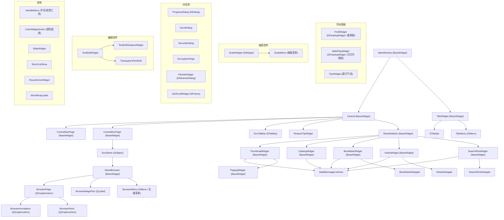

# deepin-reader AT-SPI UI Map

## 应用概况

| 项目 | 值 |
|------|------|
| 应用名 | deepin-reader (文档查看器) |
| 源码路径 | `reader/` |
| 构建系统 | CMake + qmake |
| UI 框架 | Qt5 + DTK (DWidget) |
| 文档格式 | PDF, DjVu, XPS |
| 入口 | `reader/main.cpp` → `Application` → `MainWindow` |
| AT-SPI 工厂 | `QAccessible::installFactory(accessibleFactory)` → `reader/main.cpp:108` |
| AT 命名 | `getAccessibleName()` → `reader/app/accessibledefine.h:22-90` |
| AT 注册表 | `accessibleFactory()` → `reader/app/accessible.h:87-130` |

---

## 组件树 (Mermaid)



---

## 控件表

| 类名 | 文件 | 基类 | AT 注册 | setAccessibleName | setObjectName | 说明 |
|------|------|------|---------|-------------------|---------------|------|
| MainWindow | reader/MainWindow.h | BaseWidget | ✅ | ✅ (line 620) | - | 主窗口 |
| Central | reader/uiframe/Central.h | BaseWidget | ✅ | - | - | 中央容器 |
| CentralDocPage | reader/uiframe/CentralDocPage.h | BaseWidget | ✅ | - | - | 文档浏览堆栈 |
| CentralNavPage | reader/uiframe/CentralNavPage.h | BaseWidget | ✅ | ✅ (lines 23,37,44,58) | ✅ (lines 43,57) | 空导航页 |
| DocSheet | reader/uiframe/DocSheet.h | QObject | ✅ | - | ✅ | 文档会话 |
| DocTabBar | reader/uiframe/DocTabBar.h | DTabBar | ✅ | - | - | 标签页栏 |
| TitleWidget | reader/uiframe/TitleWidget.h | BaseWidget | ✅ | ✅ (line 22) | ✅ (line 21) | 标题栏 |
| TitleMenu | reader/uiframe/TitleMenu.h | DMenu | - | ✅ (line 43) | - | 主菜单 (瞬态) |
| SheetSidebar | reader/sidebar/SheetSidebar.h | BaseWidget | ✅ | ✅ (line 363) | ✅ (line 362) | 左侧栏 |
| SheetBrowser | reader/browser/SheetBrowser.h | BaseWidget | ✅ | ✅ (lines 90,98,101) | - | 文档浏览器 |
| BrowserMenu | reader/browser/BrowserMenu.h | DMenu | - | ✅ (line 19) | - | 文档右键菜单 (瞬态) |
| BrowserPage | reader/browser/BrowserPage.h | QGraphicsItem | - | - | - | 文档页（图形项） |
| BrowserMagniFier | reader/browser/BrowserMagniFier.h | QLabel | - | - | - | 放大镜 |
| BrowserAnnotation | reader/browser/BrowserAnnotation.h | QGraphicsItem | - | - | - | 批注图形项 |
| BrowserWord | reader/browser/BrowserWord.h | QGraphicsItem | - | - | - | 文字选择图形项 |
| ThumbnailWidget | reader/sidebar/ThumbnailWidget.h | BaseWidget | ✅ | ✅ (lines 38,43,50) | - | 缩略图视图 |
| CatalogWidget | reader/sidebar/CatalogWidget.h | BaseWidget | ✅ | ✅ (lines 40,55) | - | 目录视图 |
| BookMarkWidget | reader/sidebar/BookMarkWidget.h | BaseWidget | ✅ | ✅ (lines 45,52,68) | ✅ (line 51) | 书签视图 |
| NotesWidget | reader/sidebar/NotesWidget.h | BaseWidget | ✅ | ✅ (lines 46,55,66) | ✅ (line 54) | 注释视图 |
| SearchResWidget | reader/sidebar/SearchResWidget.h | BaseWidget | ✅ | ✅ (line 43) | - | 搜索结果 |
| SideBarImageListView | reader/sidebar/SideBarImageListview.h | BaseWidget | - | ✅ (lines 276,304) | ✅ (lines 29,31) | 侧栏列表视图 |
| FindWidget | reader/widgets/FindWidget.h | DFloatingWidget | - | ✅ (lines 120,122) | ✅ (lines 119,121,129,136,143) | 查找面板 |
| PagingWidget | reader/widgets/PagingWidget.h | BaseWidget | - | ✅ (lines 74,81,84,100,107,112) | ✅ (lines 82,83,101,108) | 页码导航 |
| ScaleWidget | reader/widgets/ScaleWidget.h | DWidget | - | - | ✅ (lines 42,43,52,72,79) | 缩放控件 |
| ScaleMenu | reader/widgets/ScaleMenu.h | - | - | - | ✅ (line 117) | 缩放菜单 |
| HandleMenu | reader/widgets/HandleMenu.h | - | - | - | ✅ (lines 27,35) | 工具切换菜单 |
| EncryptionPage | reader/widgets/EncryptionPage.h | - | - | - | ✅ (lines 46,50) | 加密页 |
| SlidePlayWidget | reader/widgets/SlidePlayWidget.h | DFloatingWidget | - | ✅ (line 160) | - | 幻灯片控制 |
| ColorWidgetAction | reader/widgets/ColorWidgetAction.h | - | - | - | ✅ (line 66) | 颜色选择 |
| EyeProtectionAction | reader/eyeprotection/EyeProtectionAction.h | - | - | - | ✅ (line 64) | 护眼模式 |
| SheetRenderer | reader/uiframe/SheetRenderer.h | QObject | - | - | - | 文档渲染器 |
| TransparentTextEdit | reader/widgets/TransparentTextEdit.h | - | - | - | ✅ (line 26) | 透明文本编辑 |
| TextEditShadowWidget | reader/widgets/TextEditWidget.h | - | - | - | ✅ (line 52) | 文本编辑阴影 |

---

## 菜单索引

### 主菜单 (TitleMenu)

文件: `reader/uiframe/TitleMenu.cpp`
类型: `DMenu`，瞬态弹出

| 菜单项 | 触发方式 | 说明 |
|--------|----------|------|
| 在文件管理器中显示 | 主菜单 | 定位文件 |
| 放大镜 | 主菜单 | 启用放大区域 |
| 工具 → 选择工具 | 主菜单 → 子菜单 | 文本选择 |
| 工具 → 手形工具 | 主菜单 → 子菜单 | 页面移动 |
| 主题 → 浅色主题 | 主菜单 → 子菜单 | 窗口主题 |
| 主题 → 深色主题 | 主菜单 → 子菜单 | 窗口主题 |
| 主题 → 系统主题 | 主菜单 → 子菜单 | 窗口主题 |
| 帮助 | 主菜单 | 打开帮助手册 |
| 关于 | 主菜单 | 版本信息 |
| 退出 | 主菜单 | 退出应用 |

### 右键菜单

#### 文档区域右键菜单 (BrowserMenu)
文件: `reader/browser/BrowserMenu.cpp`
类型: `DMenu`，瞬态弹出

| 菜单项 | 说明 |
|--------|------|
| 复制 | 复制选中文本 |
| 选择全部 | 全选 |
| 添加书签 | 快捷添加书签 |
| 放大 | 放大页面 |
| 缩小 | 缩小页面 |

#### 侧栏书签右键菜单
文件: `reader/sidebar/SideBarImageListview.cpp:299-318`
触发: `showBookMarkMenu` 右键书签项

| 菜单项 | 说明 |
|--------|------|
| 跳转到 | 跳转书签位置 |
| 编辑书签 | 修改书签 |
| 删除书签 | 删除书签 |
| 删除全部 | 清空书签 |

#### 侧栏注释右键菜单
文件: `reader/sidebar/SideBarImageListview.cpp:270-297`
触发: `showNoteMenu` 右键注释项

| 菜单项 | 说明 |
|--------|------|
| 跳转到 | 跳转注释位置 |
| 删除 | 删除注释 |
| 删除全部 | 清空注释 |

---

## 对话框索引

| 对话框 | 文件 | 类型 | 触发条件 |
|--------|------|------|----------|
| 加密弹窗 | reader/widgets/EncryptionPage.cpp | DDialog | 打开加密 PDF |
| 保存确认 | reader/widgets/SaveDialog.cpp | QDialog | 关闭未保存文档 |
| 文件属性 | reader/widgets/FileAttrWidget.cpp | DAbstractDialog | 主菜单 → 文件信息 |
| 加载进度 | reader/widgets/ProgressDialog.cpp | DDialog | 打开大文档 |
| 安全提示 | reader/widgets/SecurityDialog.cpp | DDialog | 安全操作确认 |
| 关于对话框 | TitleMenu → 关于 | DDialog | 主菜单 → 关于 |
| 文件打开 | Central::addFilesWithDialog | DFileDialog | 主菜单/工具栏打开 |
| 另存为 | CentralDocPage::saveAsCurrent | DFileDialog | 主菜单 → 另存为 |

---

## 快捷键索引

| 快捷键 | 功能 | 注册位置 |
|--------|------|----------|
| Ctrl+O | 打开文件 | Central::Central |
| Ctrl+N | 新建窗口 | Central |
| Ctrl+T | 新建标签页 | Central |
| Ctrl+W | 关闭标签页 | Central |
| Ctrl+Q | 退出 | Central |
| Ctrl+S | 保存 | Central |
| Ctrl+Shift+S | 另存为 | Central |
| Ctrl+F | 查找 | Central |
| Ctrl+D | 添加书签 | Central |
| Ctrl++ | 放大 | Central |
| Ctrl+- | 缩小 | Central |
| Ctrl+0 | 适应窗口 | Central |
| Ctrl+1 | 适应宽度 | Central |
| Ctrl+Shift+P | 打印 | Central |
| F11 | 全屏 | Central |
| Esc | 取消/退出全屏 | Central / BrowserMagniFier |
| Alt+1 | 左侧栏→缩略图 | Central |
| Alt+2 | 左侧栏→目录 | Central |
| Alt+3 | 左侧栏→书签 | Central |
| Alt+4 | 左侧栏→注释 | Central |
| Alt+5 | 左侧栏→搜索结果 | Central |
| ↑/↓/←/→ | 页面滚动 | SheetBrowser |
| PageUp/PageDown | 上下翻页 | SheetBrowser |
| Home/End | 首页/尾页 | SheetBrowser |
| / | 快速搜索 | Central |
| N | 查找下一个 | Central |

---

## AT 命名规则

```cpp
// getAccessibleName() 在 reader/app/accessibledefine.h:22-90
// 命名模式: <RolePrefix>_<accessibleName/fallback>[_<N>]
// SEPARATOR = "_"

// 角色前缀映射:
Form    → "Form_"     (QAccessible::Form)
Button  → "Button_"   (QAccessible::Button)
Label   → "Label_"    (QAccessible::StaticText)
Editable→ "Editable_" (QAccessible::EditableText)
Slider  → "Slider_"   (QAccessible::Slider)
// 其他 → QMetaEnum::valueToKeys(r) + "_"

// 唯一性: 同名控件自动加 _N 后缀
```

---

## 文件索引

| 文件 | 内容 |
|------|------|
| `reader/app/accessibledefine.h` | AT 命名宏/函数 (getAccessibleName, SET_*_ACCESSIBLE) |
| `reader/app/accessible.h` | AT 工厂 (accessibleFactory) |
| `reader/main.cpp:108` | installFactory 调用点 |
| `reader/MainWindow.cpp:620` | MainWindow setAccessibleName |
| `reader/uiframe/TitleWidget.cpp:16-92` | 标题栏初始化 + setAccessibleName |
| `reader/uiframe/TitleMenu.cpp:13-50` | 主菜单初始化 + setAccessibleName |
| `reader/uiframe/CentralNavPage.cpp:18-73` | 导航页 + setAccessibleName/setObjectName |
| `reader/browser/SheetBrowser.cpp:53-123` | 文档浏览器 + setAccessibleName |
| `reader/browser/BrowserMenu.cpp:16-22` | 右键菜单 setAccessibleName |
| `reader/sidebar/SheetSidebar.cpp:356-372` | 侧栏按钮创建 + setAccessibleName |
| `reader/sidebar/SideBarImageListview.cpp:20-46` | 侧栏列表 + setObjectName |
| `reader/sidebar/SideBarImageListview.cpp:270-318` | 右键菜单 showNoteMenu/showBookMarkMenu |
| `reader/sidebar/BookMarkWidget.cpp:39-76` | 书签视图 + setAccessibleName/setObjectName |
| `reader/sidebar/CatalogWidget.cpp:28-59` | 目录视图 + setAccessibleName |
| `reader/sidebar/NotesWidget.cpp:37-73` | 注释视图 + setAccessibleName/setObjectName |
| `reader/sidebar/SearchResWidget.cpp:34-56` | 搜索结果 + setAccessibleName |
| `reader/sidebar/ThumbnailWidget.cpp:34-55` | 缩略图 + setAccessibleName |
| `reader/widgets/FindWidget.cpp:115-199` | 查找面板 + setAccessibleName/setObjectName |
| `reader/widgets/PagingWidget.cpp:70-131` | 页码控件 + setAccessibleName/setObjectName |
| `reader/widgets/ScaleWidget.cpp:33-88` | 缩放控件 + setObjectName |
| `reader/widgets/ScaleMenu.cpp:113-122` | 缩放菜单 + setObjectName |
| `reader/widgets/SlidePlayWidget.cpp:156-166` | 幻灯片控制 setAccessibleName |
| `reader/eyeprotection/EyeProtectionAction.cpp:38-82` | 护眼模式 setObjectName |
| `reader/widgets/EncryptionPage.cpp:31-78` | 加密页 setObjectName |
| `reader/widgets/HandleMenu.cpp:19-41` | 工具切换 setObjectName |
| `reader/widgets/ColorWidgetAction.cpp:47-94` | 颜色选择 setObjectName |
| `reader/widgets/TextEditWidget.cpp:30-56` | 文本编辑 setObjectName |
| `reader/uiframe/Central.cpp:26-99` | 中央容器 + 快捷键注册 |
| `reader/browser/SheetBrowser.cpp:2188-2229` | 链接跳转 |
| `reader/uiframe/DocSheet.cpp:1791-1797` | 信息弹窗 |
| `reader/widgets/SaveDialog.cpp:26-53` | 保存/退出弹窗 |