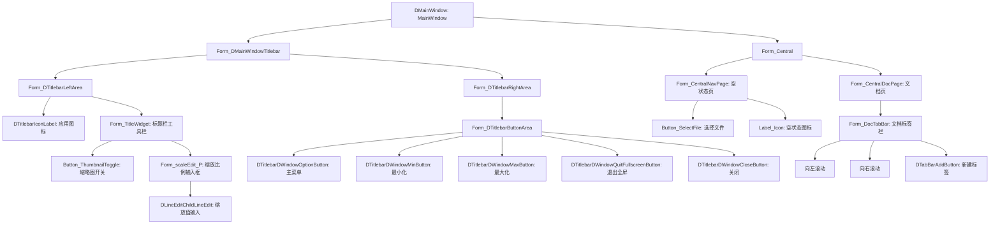

# Deepin Reader UI 图谱

> 生成时间: 2026-08-20
> 推导方式: 源码静态分析 via remote-codebase MCP

## 组件树

## 控件表

### 已注册自定义控件（14 个 SET_FORM_ACCESSIBLE 注册类）

| 控件类 | 注册名 | 文件 | 行号 |
|--------|--------|------|------|
| Central | Form_Central | reader/app/accessibledefine.h | 定义 |
| CentralDocPage | Form_CentralDocPage | 同上 | 同上 |
| CentralNavPage | Form_CentralNavPage | 同上 | 同上 |
| TitleWidget | Form_TitleWidget | 同上 | 同上 |
| SheetSidebar | Form_SheetSidebar | 同上 | 同上 |
| DocSheet | Form_DocSheet | 同上 | 同上 |
| DocTabBar | Form_DocTabBar | 同上 | 同上 |
| BrowserMenu | Form_BrowserMenu | 同上 | 同上 |
| BrowserPage | Form_BrowserPage | 同上 | 同上 |
| ShortCutShow | DShortcutShow | 同上 | 同上 |
| SaveDialog | DDialog | 同上 | 同上 |
| SheetBrowser | Form_SheetBrowser | 同上 | 同上 |
| FindWidget | Form_FindWidget | 同上 | 同上 |
| TitleMenu | Form_TitleMenu | 同上 | 同上 |

### 有显式 setAccessibleName 的控件

| 名称 | 对象 | 文件 |
|------|------|------|
| Button_ThumbnailToggle | 缩略图侧栏开关 | reader/uiframe/TitleWidget.cpp |
| Button_SelectFile | 选择文件按钮 | reader/uiframe/CentralNavPage.cpp |
| Label_Icon | 空状态图标 | reader/uiframe/CentralNavPage.cpp |

### 由 DTK/Qt fallback 自动生成名称的控件

| 运行时名称 | 来源 | 类型 |
|-----------|------|------|
| DTitlebarIconLabel | DTK fallback | 应用图标 |
| DLineEditChildLineEdit | Qt fallback | 缩放输入框 |
| DTitlebarDWindowOptionButton | DTK fallback | 主菜单按钮 |
| DTitlebarDWindowMinButton | DTK fallback | 最小化 |
| DTitlebarDWindowMaxButton | DTK fallback | 最大化 |
| DTitlebarDWindowQuitFullscreenButton | DTK fallback | 退出全屏 |
| DTitlebarDWindowCloseButton | DTK fallback | 关闭 |
| DTabBarAddButton | DTK fallback | 新建标签 |
| DTitlebarMainMenu | DTK fallback | 主菜单弹出框 |
| 新窗口 | 菜单位文本 | 菜单项 |
| 新标签页 | 菜单位文本 | 菜单项 |
| 保存 | 菜单位文本 | 菜单项 |
| 另存为 | 菜单位文本 | 菜单项 |
| 在文件管理器中显示 | 菜单位文本 | 菜单项 |
| 放大镜 | 菜单位文本 | 菜单项 |
| 工具 | 菜单位文本 | 菜单项 |
| 向左滚动 | DTK fallback | 标签滚动按钮 |
| 向右滚动 | DTK fallback | 标签滚动按钮 |

## 菜单

### 主菜单（DTitlebarMainMenu）

| 菜单项 | 子菜单项 | 触发条件 |
|--------|---------|----------|
| 新窗口 | — | 始终 |
| 新标签页 | — | 始终 |
| 保存 | — | 有文档打开 |
| 另存为 | — | 有文档打开 |
| 在文件管理器中显示 | — | 有文档打开 |
| 放大镜 | — | 有文档打开 |
| 工具 | 提取文本 / 翻译 / 截图 / 全屏 / 朗读 | 有文档打开 |
| 设置 | — | 始终 |
| 帮助 | 帮助 / 关于 | 始终 |

### 右键菜单（BrowserMenu）

| 菜单项 | 子菜单项 | 触发条件 |
|--------|---------|----------|
| 复制 | — | 有选中文本 |
| 提取文本 | — | 始终 |
| 翻译 | — | 始终 |
| 截图 | — | 始终 |
| 全屏 | — | 始终 |
| 朗读 | — | 有选中文本 |
| 打印 | — | 始终 |
| 选择文本 | — | 始终 |
| 放大 | — | 始终 |
| 缩小 | — | 始终 |
| 适应宽度 | — | 始终 |
| 适应高度 | — | 始终 |
| 双页显示 | — | 始终 |
| 滚动方向 | 垂直滚动 / 水平滚动 | 始终 |
| 旋转 | 顺时针 / 逆时针 | 始终 |

## 对话框

| 对话框 | 类型 | 触发条件 | 文件 |
|--------|------|----------|------|
| 设置对话框 | DDialog | 菜单 → 设置 | reader/uiframe/TitleMenu.cpp |
| 关于对话框 | DAboutDialog | 菜单 → 帮助 → 关于 | reader/uiframe/TitleMenu.cpp |
| 快捷键提示 | DShortcutShow | 菜单 → 帮助 → 帮助 | reader/widgets/ShortCutShow.cpp |
| 保存对话框 | DDialog | 关闭未保存文档 | reader/widgets/SaveDialog.h |
| 安全提醒对话框 | DDialog | 打开加密文档 | reader/widgets/SecurityDialog.h |
| 进度对话框 | DDialog | 导出/打印操作 | reader/widgets/ProgressDialog.h |
| 文件属性对话框 | DDialog | 菜单 → 信息 | reader/widgets/FileAttrWidget.h |
| 加密页面 | EncryptionPage | 加密文档 | reader/widgets/EncryptionPage.h |

## 快捷键

| 快捷键 | 功能 | 文件 |
|--------|------|------|
| Ctrl+O | 打开文件 | reader/uiframe/TitleMenu.cpp |
| Ctrl+N | 新窗口 | reader/uiframe/TitleMenu.cpp |
| Ctrl+T | 新标签页 | reader/uiframe/TitleMenu.cpp |
| Ctrl+S | 保存 | reader/uiframe/TitleMenu.cpp |
| Ctrl+Shift+S | 另存为 | reader/uiframe/TitleMenu.cpp |
| Ctrl+W | 关闭标签页 | reader/uiframe/TitleMenu.cpp |
| Ctrl+Q | 退出 | reader/uiframe/TitleMenu.cpp |
| Ctrl++ | 放大 | reader/browser/BrowserMenu.cpp |
| Ctrl+- | 缩小 | reader/browser/BrowserMenu.cpp |
| Ctrl+0 | 原始大小 | reader/browser/BrowserMenu.cpp |
| F11 | 全屏 | reader/browser/BrowserMenu.cpp |
| Ctrl+F | 查找 | reader/browser/BrowserMenu.cpp |
| F1 | 帮助 | reader/uiframe/TitleMenu.cpp |
| Ctrl+Shift+/ | 快捷键查看 | reader/widgets/ShortCutShow.cpp |
| Esc | 退出全屏/关闭查找框 | reader/MainWindow.cpp |

## 侧栏组件

侧栏由 SheetSidebar 管理，包含 5 个堆叠面板：

| 面板 | 控件类 | 功能 |
|------|--------|------|
| 缩略图 | ThumbnailWidget | 文档缩略图预览 |
| 目录 | CatalogWidget | 章节导航 |
| 书签 | BookMarkWidget | 书签管理 |
| 注释 | NotesWidget | 注释列表 |
| 搜索结果 | SearchResWidget | 搜索结果显示 |

## 文件:行号索引

| 文件 | 说明 |
|------|------|
| reader/app/accessibledefine.h | AT 注册表（14 个 SET_FORM_ACCESSIBLE） |
| reader/app/accessible.h | 通用 accessible 工厂 + 15 个 accessible 类 |
| reader/main.cpp | installFactory 入口 |
| reader/MainWindow.cpp | 主窗口初始化 |
| reader/uiframe/TitleWidget.cpp | 标题栏工具栏控件 |
| reader/uiframe/Central.cpp | 中央区域切换 |
| reader/uiframe/TitleMenu.cpp | 主菜单定义 |
| reader/browser/BrowserMenu.cpp | 右键菜单定义 |
| reader/widgets/ScaleWidget.cpp | 缩放控件 |
| reader/widgets/SlidePlayWidget.cpp | 幻灯片播放控件 |
| reader/widgets/SlideWidget.cpp | 幻灯片控件 |
| reader/widgets/TextEditWidget.cpp | 文本编辑控件 |
| reader/widgets/EncryptionPage.cpp | 加密页面 |
| reader/widgets/HandleMenu.cpp | 右键处理菜单 |
| reader/widgets/RestoreTipWidget.cpp | 恢复提示控件 |
| reader/widgets/ProgressDialog.cpp | 进度对话框 |
| reader/widgets/SecurityDialog.cpp | 安全提醒对话框 |
| reader/widgets/ShortCutShow.cpp | 快捷键提示 |