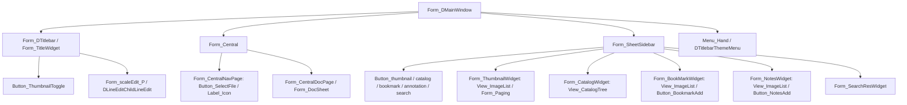

# UI 图谱 — deepin-reader (Qt/DTK C++)

> 推导方式：**本地静态源码分析 + 运行时 at-tree.yaml 对账**（remote-codebase MCP 在本子代理工具链中不可用，已按要求跳过并降级为本地推导，见源码文件:行号）。
> 组件注册契约：`reader/app/accessible.h` + `reader/app/accessibledefine.h`。

## 命名算法（reader/app/accessibledefine.h:27-90）
- `getAccessibleName(w, role, fallback)`：按 role 加前缀 `Form_ / Button_ / Label_ / Editable_ / Slider_`（accessibledefine.h:33-55）。
- 名称优先级：`w->accessibleName()`(即 setAccessibleName) > 注册 fallback > role 前缀。重复自动追加 `_1/_2…`（去重，`_N` 为运行期动态值）。
- 工厂：`app/main.cpp:108` `QAccessible::installFactory(accessibleFactory)`，提供方 `app/accessible.h:~135 accessibleFactory()`。

## 组件树（mermaid）

## 控件类注册表（accessible.h:49-135）
| 类 | 前缀/注册名 | 角色 |
|---|---|---|
| MainWindow/Central/CentralDocPage/CentralNavPage/DocSheet/DocTabBar/TitleWidget/SheetSidebar/SheetBrowser/ThumbnailWidget/CatalogWidget/BookMarkWidget/NotesWidget/SearchResWidget | 类名 | Form |
| QPushButton | text 或 qpushbutton | Button |
| QSlider | qslider | Slider |
| QFrame/QWidget/DFrame/DWidget/DBackgroundGroup/DSearchEdit/DTitlebar/DDialog/DFileDialog | objectName 或 fallback | Form |
| DSwitchButton/DFloatingButton/DIconButton/DCheckBox/DToolButton/DPushButton/DCommandLinkButton | objectName/toolTip/text | Button |
| DLabel | objectName（注释"不生效"） | Label |

## 显式 setAccessibleName / setObjectName（对账）

| 位置 | 名称 |
|---|---|
| reader/uiframe/TitleMenu.cpp:43 | Menu_Hand |
| reader/uiframe/TitleWidget.cpp:22 | Button_ThumbnailToggle (objectName Thumbnails) |
| reader/uiframe/CentralNavPage.cpp:23,37 | Label_Drag documents here / Label_format supported: %1 |
| reader/uiframe/CentralNavPage.cpp:44 | SelectFile (objectName SelectFileBtn) |
| reader/uiframe/CentralNavPage.cpp:58 | Label_Icon |
| reader/widgets/PagingWidget.cpp:74,81,84,100,107,112 | Label_TotalPage / Page / pageEdit / Button_ThumbnailPre / Button_ThumbnailNext / CurrentPage |
| reader/widgets/FindWidget.cpp:120,122 | Form_findSearchEdit_P / FormDLineEditChildLineEdit |
| reader/sidebar/SheetSidebar.cpp:363 | Button_thumbnail/catalog/bookmark/annotation/search |
| reader/sidebar/BookMarkWidget.cpp:45,52,68 | View_ImageList / BookmarkAdd / BookMarkLine |
| reader/sidebar/NotesWidget.cpp:46,55,66 | View_ImageList / NotesAdd / NotesLine |
| reader/sidebar/CatalogWidget.cpp:40,55 | Label_title / View_CatalogTree |
| reader/sidebar/ThumbnailWidget.cpp:38,43,50 | View_ImageList / Paging / ThumbnailLine |
| reader/sidebar/SideBarImageListview.cpp:276,304 | Menu_Catalog / Menu_BookMark |

## 菜单 / 对话框 / 快捷键
- **TitleMenu.cpp**: 主菜单动作 `New window / New tab / Save / Save as / Display in file manager / Magnifer / Search / Print` + Tools子菜单(HandleMenu)。使能条件见 onCurSheetChanged:37-57（无文档禁用 Save、Search 仅 PDF/DOCX 可见）。
- **SideBarImageListview.cpp**: 右键菜单 Menu_Note/Catalog/BookMark（复制/删除/全部删除）。
- **HandleMenu.cpp**: 文本/手形工具切换动作(defaultshape / handleshape)。
- **对话框**: SaveDialog, FindWidget, EncryptionPage(DPasswordEdit passwdEdit / ensureBtn)。
- **快捷键**: Central.cpp:95 setShortcut 动态绑定。

## 文件:行号索引
结构/命名：`app/accessibledefine.h:27,33,177-367`; 注册表：`app/accessible.h:49-135`; 工厂安装：`app/main.cpp:108`; 顶部工具栏：`uiframe/TitleWidget.cpp:21-22`; 侧边栏按钮：`sidebar/SheetSidebar.cpp:75-145,362-364`; 各 tab 控件：`sidebar/*.cpp`（见上表）。
