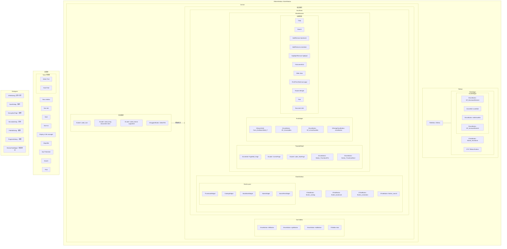

# Deepin Reader UI Map

## 组件树 (Mermaid)

## 控件表

| 控件类 | 文件 | AT-SPI 名称(推导) | Role | 可交互 |
|--------|------|-------------------|------|--------|
| MainWindow | reader/MainWindow.h | `Form_MainWindow` | Form | 是 |
| Central | reader/uiframe/Central.h | `Form_Central` | Form | 否(容器) |
| CentralDocPage | reader/uiframe/CentralDocPage.h | `Form_CentralDocPage` | Form | 否(容器) |
| CentralNavPage | reader/uiframe/CentralNavPage.h | `Form_CentralNavPage` | Form | 否(容器) |
| DocSheet | reader/uiframe/DocSheet.h | `Form_DocSheet` | Form | 否(容器) |
| DocTabBar | reader/uiframe/DocTabBar.h | `Form_DocTabBar` | Form | 是 |
| TitleWidget | reader/uiframe/TitleWidget.h | `Form_TitleWidget` | Form | 否(容器) |
| SheetSidebar | reader/sidebar/SheetSidebar.h | `Form_SheetSidebar` | Form | 否(容器) |
| SheetBrowser | reader/sidebar/SheetBrowser.h | `Form_SheetBrowser` | Form | 否(容器) |
| ThumbnailWidget | reader/sidebar/ThumbnailWidget.h | `Form_ThumbnailWidget` | Form | 否(容器) |
| CatalogWidget | reader/sidebar/CatalogWidget.h | `Form_CatalogWidget` | Form | 否(容器) |
| BookMarkWidget | reader/sidebar/BookMarkWidget.h | `Form_BookMarkWidget` | Form | 否(容器) |
| NotesWidget | reader/sidebar/NotesWidget.h | `Form_NotesWidget` | Form | 否(容器) |
| SearchResWidget | reader/sidebar/SearchResWidget.h | `Form_SearchResWidget` | Form | 否(容器) |

### 显式 setAccessibleName 控件

| 控件 | 名称 | 文件:行 |
|------|------|---------|
| TitleMenu | `Menu_Title` | MainWindow.cpp:620 |
| TitleMenu 菜单项(New window) | objectName=`New window` | TitleMenu.cpp:19 |
| TitleMenu 菜单项(New tab) | objectName=`New tab` | TitleMenu.cpp:19 |
| TitleMenu 菜单项(Save) | objectName=`Save` | TitleMenu.cpp:31 |
| TitleMenu 菜单项(Save as) | objectName=`Save as` | TitleMenu.cpp:31 |
| HandleMenu(Tools子菜单) | `Menu_Hand` | TitleMenu.cpp:45 |
| HandleMenu 动作(Select Text) | objectName=`defaultshape` | HandleMenu.cpp:27 |
| HandleMenu 动作(Hand Tool) | objectName=`handleshape` | HandleMenu.cpp:34 |
| 缩略图切换按钮 | `Button_ThumbnailToggle` | TitleWidget.cpp:22 |
| 侧栏缩略图按钮 | `Button_thumbnail` | SheetSidebar.cpp:363 |
| 侧栏目录按钮 | `Button_catalog` | SheetSidebar.cpp:363 |
| 侧栏书签按钮 | `Button_bookmark` | SheetSidebar.cpp:363 |
| 侧栏注释按钮 | `Button_annotation` | SheetSidebar.cpp:363 |
| 侧栏搜索按钮 | `Button_search` | SheetSidebar.cpp:363 |
| 搜索输入框 | `Form_findSearchEdit_P` | FindWidget.cpp:120 |
| 搜索-上箭头按钮 | objectName=`SP_ArrowUpBtn` | FindWidget.cpp:122 |
| 搜索-下箭头按钮 | objectName=`SP_ArrowDownBtn` | FindWidget.cpp:129 |
| 搜索-关闭按钮 | objectName=`closeButton` | FindWidget.cpp:136 |
| 缩放输入框 | objectName=`scaleEdit_P` | ScaleWidget.cpp:42 |
| 缩放-减按钮 | objectName=`SP_DecreaseElement` | ScaleWidget.cpp:72 |
| 缩放-加按钮 | objectName=`SP_IncreaseElement` | ScaleWidget.cpp:79 |
| 缩放-下拉箭头 | objectName=`editArrowBtn` | ScaleWidget.cpp:52 |
| 翻页输入框 | `Page` / `Edit_Page` | PagingWidget.cpp:74 |
| 翻页-上一页 | `Button_ThumbnailPre` | PagingWidget.cpp:100 |
| 翻页-下一页 | `Button_ThumbnailNext` | PagingWidget.cpp:107 |
| 翻页-当前页 | `CurrentPage` | PagingWidget.cpp:112 |
| 翻页-总页数 | `Label_TotalPage` | PagingWidget.cpp:74 |
| 欢迎页-拖拽提示 | `Label_Drag documents here` | CentralNavPage.cpp:23 |
| 欢迎页-格式提示 | `Label_format supported: PDF,DJVU,DOCX` | CentralNavPage.cpp:37 |
| 欢迎页-选择文件按钮 | `SelectFile` | CentralNavPage.cpp:44 |
| 欢迎页-图标 | `Label_Icon` | CentralNavPage.cpp:58 |

## 菜单/对话框/快捷键索引

### 主菜单 (TitleMenu)
| 菜单项 | objectName | 键盘快捷键 | 条件 |
|--------|-----------|-----------|------|
| New window | New window | Ctrl+N | 始终 |
| New tab | New tab | Ctrl+T | 始终 |
| Save | Save | Ctrl+S | 文档打开 |
| Save as | Save as | Ctrl+Shift+S | 文档打开 |
| Display in file manager | Display in file manager | - | 文档打开 |
| Magnifier | Magnifer | - | 文档打开 |
| Eye Protection | - | - | 始终 |
| Tools → Select Text | defaultshape | - | 文档打开 |
| Tools → Hand Tool | handleshape | - | 文档打开 |
| Search | Search | Ctrl+F | 文档打开 |
| Print | Print | Ctrl+P | 文档打开 |

### 文档右键菜单 (BrowserMenu)
| 菜单项 | objectName | 条件 |
|--------|-----------|------|
| Copy | Copy / CopyAnnoText | 选中文本/注释 |
| Search | Search | PDF/DOCX/XPS |
| Add bookmark | AddBookmark | 无书签时 |
| Remove bookmark | RemoveBookmark | 已有书签时 |
| Add annotation | AddAnnotationIcon / AddAnnotationHighlight | PDF/DOCX |
| Remove annotation | RemoveAnnotation | 已有注释时 |
| Highlight | AddTextHighlight | 选中文本/PDF/DOCX |
| Remove highlight | RemoveHighlight | 已有高亮 |
| Change annotation color | ChangeAnnotationColor | 注释高亮 |
| Fullscreen / Exit fullscreen | Fullscreen / ExitFullscreen | 切换 |
| Slide show | SlideShow | 始终 |
| First page | FirstPage | 非首页时启用 |
| Previous page | PreviousPage | 非首页时启用 |
| Next page | NextPage | 非末页时启用 |
| Last page | LastPage | 非末页时启用 |
| Rotate left | RotateLeft | 始终 |
| Rotate right | RotateRight | 始终 |
| Print | Print | 始终 |
| Document info | DocumentInfo | 始终 |

### 侧栏书签右键菜单 (SideBarImageListView)
| 菜单项 | 说明 |
|--------|------|
| 编辑 | 编辑书签 |
| 删除 | 删除书签 |
| 跳转 | 跳转到书签页 |

### 侧栏注释右键菜单 (SideBarImageListView)
| 菜单项 | 说明 |
|--------|------|
| 编辑 | 编辑注释 |
| 删除 | 删除注释 |
| 跳转 | 跳转到注释页 |

### 对话框
| 对话框类 | 文件 | 触发条件 |
|---------|------|---------|
| DFileDialog | 系统文件对话框 | Ctrl+O / 选择文件按钮 / 打开文件 |
| SaveDialog | reader/widgets/SaveDialog.h | 文件另存为 |
| EncryptionPage | reader/widgets/EncryptionPage.h | 打开加密文档 |
| SecurityDialog | reader/widgets/SecurityDialog.h | 安全设置 |
| FileAttrDialog | reader/widgets/FileAttrWidget.h | 文档信息 |
| ProgressDialog | reader/widgets/ProgressDialog.h | 长耗时操作 |
| RestoreTipWidget | reader/widgets/RestoreTipWidget.h | 恢复阅读位置 |
| ShortCutShow | reader/widgets/ShortCutShow.h | Ctrl+Shift+/ |

### 键盘快捷键
| 快捷键 | 功能 | 实现位置 |
|--------|------|---------|
| Ctrl+O | 打开文件 | Central.cpp:218 |
| Ctrl+N | 新建窗口 | Central.cpp(shortcut map) |
| Ctrl+T | 新建标签 | Central.cpp(shortcut map) |
| Ctrl+W | 关闭标签 | Central.cpp(shortcut map) |
| Ctrl+S | 保存 | Central.cpp(shortcut map) |
| Ctrl+Shift+S | 另存为 | Central.cpp(shortcut map) |
| Ctrl+P | 打印 | Central.cpp(shortcut map) |
| Ctrl+F | 查找 | Central.cpp(shortcut map) |
| Ctrl+D | 添加书签 | Central.cpp:89 |
| Ctrl+M | 放大镜 | Central.cpp:90 |
| Ctrl+R | 旋转 | Central.cpp:91 |
| Ctrl+Shift+R | 恢复/重置 | Central.cpp:95 |
| Ctrl+Shift+/ | 快捷键预览 | Central.cpp:220 |
| Ctrl+Minus | 缩小 | Central.cpp:92 |
| Ctrl+Equal | 放大 | Central.cpp:93 |
| Ctrl+Plus | 放大 | Central.cpp:94 |
| Ctrl+1 | 缩略图 | Central.cpp:86 |
| Ctrl+2 | 目录 | Central.cpp:87 |
| Ctrl+3 | 书签 | Central.cpp:88 |
| Alt+1 | 侧栏切换 | Central.cpp:81 |
| Alt+2 | 侧栏标签1 | Central.cpp:82 |
| Alt+A | 注释模式 | Central.cpp:83 |
| Alt+H | 手型工具 | Central.cpp:84 |
| Alt+Z | 选择文本 | Central.cpp:85 |
| F5 | 幻灯片 | Central.cpp:79 |
| F11 | 全屏 | Central.cpp:80 |
| Ctrl+Home | 首页 | Central.cpp:97 |
| Ctrl+End | 末页 | Central.cpp:98 |
| Escape | 退出全屏/关闭查找 | Central.cpp:78 |
| Left/Right | 上一页/下一页 | 滚动模式 |
| Up/Down | 滚动 | Central.cpp:76 |
| Space | 翻页 | Central.cpp:77 |

### 快捷键分类 (ShortCutShow)
| 分组 | 包含快捷键 |
|------|-----------|
| Settings | 系统设置相关 |
| File | Ctrl+O, Ctrl+N, Ctrl+T, Ctrl+W, Ctrl+S, Ctrl+Shift+S, Ctrl+P |
| Display | F11, F5, Ctrl+Minus, Ctrl+Equal, Ctrl+Plus, Ctrl+0, Ctrl+R, Ctrl+Shift+R |
| Tools | Ctrl+F, Ctrl+D, Ctrl+M, Ctrl+H |
| Edit | Ctrl+C, Ctrl+A, Alt+Z, Alt+A, Alt+H |