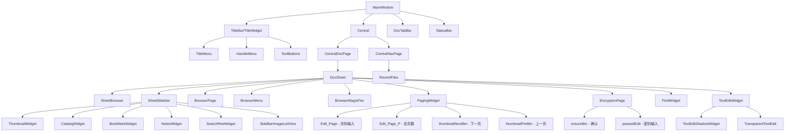

# deepin-reader UI Map (AT-SPI)

## 组件结构

## AT-SPI 控件表

| 控件名 | Role | 来源 | 所在文件 |
|--------|------|------|---------|
| MainWindow | frame | SET_FORM_ACCESSIBLE | reader/app/accessible.h |
| Central | panel | SET_FORM_ACCESSIBLE | reader/app/accessible.h |
| CentralDocPage | panel | SET_FORM_ACCESSIBLE | reader/app/accessible.h |
| CentralNavPage | panel | SET_FORM_ACCESSIBLE | reader/app/accessible.h |
| DocSheet | panel | SET_FORM_ACCESSIBLE | reader/app/accessible.h |
| DocTabBar | panel | SET_FORM_ACCESSIBLE | reader/app/accessible.h |
| TitleWidget | panel | SET_FORM_ACCESSIBLE | reader/app/accessible.h |
| SheetSidebar | panel | SET_FORM_ACCESSIBLE | reader/app/accessible.h |
| SheetBrowser | panel | SET_FORM_ACCESSIBLE | reader/app/accessible.h |
| ThumbnailWidget | panel | SET_FORM_ACCESSIBLE | reader/app/accessible.h |
| CatalogWidget | panel | SET_FORM_ACCESSIBLE | reader/app/accessible.h |
| BookMarkWidget | panel | SET_FORM_ACCESSIBLE | reader/app/accessible.h |
| NotesWidget | panel | SET_FORM_ACCESSIBLE | reader/app/accessible.h |
| SearchResWidget | panel | SET_FORM_ACCESSIBLE | reader/app/accessible.h |
| Menu_Browser | menu | setAccessibleName | reader/browser/BrowserMenu.cpp |
| Menu_BookMark | menu | setAccessibleName | reader/sidebar/SideBarImageListview.cpp |
| Menu_Note | menu | setAccessibleName | reader/sidebar/SideBarImageListview.cpp |

### 运行时可见控件（无文档打开时）

| 节点名 | Role | 注解 |
|--------|------|------|
| SideBarImageListView | panel | 左侧栏列表容器 |
| sideBarImageListView | panel | 列表视图内部 |
| sideBarImageListViewViewport | panel | 列表视口 |
| BrowserMenu | panel | 文档区域右键菜单 |
| EncryptionPage | panel | PDF密码页（条件显示） |
| HandleMenu | panel | 工具切换菜单（手形/选择） |
| PagingWidget | panel | 底部翻页控件 |
| Edit_Page | panel | 页码输入框 |
| Edit_Page_P | panel | 总页数显示 |
| thumbnailNextBtn | panel | 下一页按钮 |
| thumbnailPreBtn | panel | 上一页按钮 |
| TextEditShadowWidget | panel | 注释编辑器阴影 |
| TransparentTextEdit | panel | 注释编辑器 |

## 主菜单

| 菜单项 | 子菜单 | 快捷键 | 触发方式 |
|--------|--------|--------|---------|
| 新窗口 | - | Ctrl+N | dtk_main_menu |
| 新标签页 | - | Ctrl+T | dtk_main_menu |
| 保存 | - | Ctrl+S | dtk_main_menu |
| 另存为 | - | Ctrl+Shift+S | dtk_main_menu |
| 在文件管理器中显示 | - | - | dtk_main_menu |
| 放大镜 | - | - | dtk_main_menu |
| 工具 | 选择文本/手形工具 | - | dtk_main_menu |
| 打印 | - | Ctrl+P | dtk_main_menu |
| 主题 | 浅色/深色/跟随系统 | - | dtk_main_menu |
| 帮助 | - | F1 | dtk_main_menu |
| 关于 | - | - | dtk_main_menu |
| 退出 | - | Alt+F4 | dtk_main_menu |

## 右键菜单（文档区域）

| 场景 | 菜单项 | 说明 |
|------|--------|------|
| 未选中文本右键 | 第一页/前一页/后一页/最后一页/跳转 | 页面导航 |
| 选中文本右键 | 复制/搜索/添加注释 | 文本操作 |
| 高亮注释右键 | 添加注释/取消高亮 | 注释操作 |
| 注释图标右键 | 添加注释/删除注释 | 注释操作 |

## 侧边栏

| 标签 | 功能 | 可访问名 |
|------|------|----------|
| 缩略图 | 页面缩略图列表 | ThumbnailWidget (form) |
| 目录 | 文档目录树 | CatalogWidget (form) |
| 书签 | 书签列表 | BookMarkWidget (form), Menu_BookMark (menu) |
| 注释 | 注释列表 | NotesWidget (form), Menu_Note (menu) |
| 搜索 | 搜索结果列表 | SearchResWidget (form) |

## 对话框

| 对话框 | 控件 | 说明 |
|--------|------|------|
| 关于 | 版本信息 | 菜单"关于"打开 |
| 加密 | ensureBtn/passwdEdit | 加密PDF密码输入 |
| 文件选择 | DFileDialog | Ctrl+O 或"打开"触发 |
| 打印 | 打印机选择 | Ctrl+P 或菜单"打印" |

## 键盘快捷键

| 快捷键 | 功能 |
|--------|------|
| Ctrl+O | 打开文件 |
| Ctrl+N | 新窗口 |
| Ctrl+T | 新标签页 |
| Ctrl+W | 关闭标签页 |
| Ctrl+S | 保存 |
| Ctrl+Shift+S | 另存为 |
| Ctrl+F | 搜索 |
| Ctrl+P | 打印 |
| Ctrl+D | 添加书签 |
| Ctrl+Tab | 切换标签页 |
| Ctrl++/- | 放大/缩小 |
| Ctrl+0 | 重置缩放 |
| Ctrl+Shift+? | 快捷键预览 |
| F1 | 帮助 |
| Delete | 删除书签/注释 |
| Esc | 取消/关闭 |
| Tab | 焦点切换 |

---

引用文件列表：
- `reader/app/accessible.h` - AT-SPI 工厂注册
- `reader/main.cpp` - installFactory 调用点
- `reader/MainWindow.cpp` - 主窗口初始化
- `reader/uiframe/TitleWidget.cpp` - 标题栏
- `reader/uiframe/TitleMenu.cpp` - 菜单
- `reader/uiframe/Central.cpp` - 中央区域
- `reader/uiframe/CentralDocPage.cpp` - 文档页
- `reader/uiframe/CentralNavPage.cpp` - 导航页
- `reader/uiframe/DocSheet.cpp` - 文档表
- `reader/uiframe/DocTabBar.cpp` - 标签栏
- `reader/sidebar/SheetSidebar.cpp` - 侧边栏
- `reader/sidebar/ThumbnailWidget.cpp` - 缩略图
- `reader/sidebar/CatalogWidget.cpp` - 目录
- `reader/sidebar/BookMarkWidget.cpp` - 书签
- `reader/sidebar/NotesWidget.cpp` - 注释
- `reader/sidebar/SearchResWidget.cpp` - 搜索
- `reader/sidebar/SideBarImageListview.cpp` - 侧边栏列表
- `reader/browser/SheetBrowser.cpp` - 文档浏览器
- `reader/browser/BrowserMenu.cpp` - 浏览器菜单
- `reader/widgets/PagingWidget.cpp` - 翻页控件
- `reader/widgets/FindWidget.cpp` - 搜索控件
- `reader/widgets/HandleMenu.cpp` - 工具切换菜单
- `reader/widgets/EncryptionPage.cpp` - 加密页面
- `reader/widgets/TextEditWidget.cpp` - 文本编辑
- `reader/widgets/TransparentTextEdit.cpp` - 透明文本编辑
- `reader/widgets/ScaleWidget.cpp` - 缩放控件
- `reader/widgets/ScaleMenu.cpp` - 缩放菜单
- `reader/widgets/ColorWidgetAction.cpp` - 颜色选择
- `reader/widgets/SlidePlayWidget.cpp` - 幻灯片播放