# Deepin Reader UI Map

> Generated via remote-codebase MCP (master @ 850a66c7)
> Source: linuxdeepin/deepin-reader

---

## 组件树 (Mermaid)

```mermaid
graph TD
    MW[MainWindow - DMainWindow]
    MW --> TB[TitleBar - DTitlebar]
    TB --> TM[TitleMenu - DMenu: Menu_Title]
    TB --> TW[TitleWidget - BaseWidget: Form_TitleWidget]
    TW --> TTB[Button_ThumbnailToggle]
    TW --> SW[ScaleWidget]
    SW --> SDec[DIconButton: SP_DecreaseElement]
    SW --> SEdit[DLineEdit: scaleEdit]
    SW --> SInc[DIconButton: SP_IncreaseElement]
    SW --> SArrow[DIconButton: editArrowBtn]
    TB --> OptBtn[DTitlebarDWindowOptionButton]
    TB --> FullBtn[DTitlebarDWindowQuitFullscreenButton]
    TB --> MinBtn[DTitlebarDWindowMinButton]
    TB --> MaxBtn[DTitlebarDWindowMaxButton]
    TB --> CloseBtn[DTitlebarDWindowCloseButton]

    MW --> Central[Central - BaseWidget: Form_Central]
    Central --> NavPage[CentralNavPage - BaseWidget: Form_CentralNavPage]
    NavPage --> IconLbl[Label_Icon]
    NavPage --> DragLbl[Label_Drag documents here]
    NavPage --> FormatLbl[Label_format supported: ...]
    NavPage --> SelectBtn[SelectFile]

    Central --> DocSheet[DocSheet - BaseWidget: Form_DocSheet]
    DocSheet --> DocTabBar[DocTabBar: Form_DocTabBar]
    DocSheet --> CentralDocPage[CentralDocPage: Form_CentralDocPage]
    CentralDocPage --> SlidePlayWidget[SlidePlayWidget]

    DocSheet --> Browser[SheetBrowser - DGraphicsView: Form_SheetBrowser]
    Browser --> Tips[Tips - TipsWidget]
    Browser --> VScroll[verticalScrollBar]
    Browser --> HScroll[horizontalScrollBar]
    Browser --> BrowserMenu[Menu_Browser - DMenu]
    Browser --> TextEditShadow[TextEditShadowWidget]

    DocSheet --> Sidebar[SheetSidebar - BaseWidget: Form_SheetSidebar]
    Sidebar --> BtnCatalog[Button_Catalog]
    Sidebar --> BtnBookmark[Button_BookMark]
    Sidebar --> BtnNote[Button_Note]
    Sidebar --> BtnThumbnail[Button_Thumbnail]
    Sidebar --> BtnSearch[Button_search]

    Sidebar --> CatalogWidget[CatalogWidget: Form_CatalogWidget]
    CatalogWidget --> CatTitle[Label_title - DLabel]
    CatalogWidget --> CatTree[View_CatalogTree - CatalogTreeView]

    Sidebar --> BookMarkWidget[BookMarkWidget: Form_BookMarkWidget]
    BookMarkWidget --> BMList[View_ImageList - SideBarImageListView]
    BookMarkWidget --> BMAdd[BookmarkAdd - DPushButton]
    BookMarkWidget --> BMLine[BookMarkLine - DHorizontalLine]
    BookMarkWidget --> BMMenu[Menu_BookMark - DMenu]

    Sidebar --> NotesWidget[NotesWidget: Form_NotesWidget]
    NotesWidget --> NList[View_ImageList - SideBarImageListView]
    NotesWidget --> NAdd[NotesAdd - DPushButton]
    NotesWidget --> NLine[NotesLine - DHorizontalLine]
    NotesWidget --> NMenu[Menu_Note - DMenu]

    Sidebar --> SearchResWidget[SearchResWidget: Form_SearchResWidget]
    SearchResWidget --> SRList[View_ImageList - SideBarImageListView]

    Sidebar --> ThumbnailWidget[ThumbnailWidget: Form_ThumbnailWidget]
    ThumbnailWidget --> THList[View_ImageList - SideBarImageListView]
    ThumbnailWidget --> THPage[Paging - PagingWidget]
    ThumbnailWidget --> THLine[ThumbnailLine - DHorizontalLine]

    MW --> FindWidget[FindWidget]
    FindWidget --> SearchEdit[Form_findSearchEdit_P - DSearchEdit]
    FindWidget --> PrevBtn[SP_ArrowUpBtn - DIconButton]
    FindWidget --> NextBtn[SP_ArrowDownBtn - DIconButton]
    FindWidget --> CloseFindBtn[closeButton - DDialogCloseButton]

    Central --> RestoreTip[RestoreTipWidget]
```

---

## 控件表 (Widget Table)

| Widget类 | 文件 | AT注册 | setAccessibleName | setObjectName | 分类 | 备注 |
|----------|------|--------|-------------------|---------------|------|------|
| MainWindow | reader/MainWindow.cpp | ✅ Form | — | — | container | 注册于 accessible.h |
| Central | reader/uiframe/Central.cpp | ✅ Form | — | — | container | 注册于 accessible.h |
| CentralNavPage | reader/uiframe/CentralNavPage.cpp | ✅ Form | Label_Drag documents here, Label_format supported: PDF..., SelectFile, Label_Icon | SelectFileBtn, iconSvg | interactive | 已覆盖 |
| DocSheet | reader/uiframe/DocSheet.cpp | ✅ Form | — | — | container | 注册于 accessible.h |
| DocTabBar | reader/uiframe/DocTabBar.cpp | ✅ Form | — | — | interactive | 注册于 accessible.h |
| CentralDocPage | reader/uiframe/CentralDocPage.cpp | ✅ Form | — | — | container | 注册于 accessible.h |
| TitleWidget | reader/uiframe/TitleWidget.cpp | ✅ Form | Button_ThumbnailToggle | Thumbnails | interactive | ✅ |
| TitleMenu | reader/uiframe/TitleMenu.cpp | — | Menu_Hand (子菜单) | — | interactive | 主菜单项无accessibleName |
| SheetSidebar | reader/sidebar/SheetSidebar.cpp | ✅ Form | Button_{Catalog/BookMark/Note/Thumbnail/search} | 由createBtn生成 | interactive | 动态命名 |
| SheetBrowser | reader/browser/SheetBrowser.cpp | ✅ Form | Tips, verticalScrollBar, horizontalScrollBar | — | interactive | ✅ |
| BrowserMenu | reader/browser/BrowserMenu.cpp | — | Menu_Browser | — | interactive | 菜单项无accessibleName |
| CatalogWidget | reader/sidebar/CatalogWidget.cpp | ✅ Form | Label_title, View_CatalogTree | — | interactive | ✅ |
| BookMarkWidget | reader/sidebar/BookMarkWidget.cpp | ✅ Form | View_ImageList, BookmarkAdd, BookMarkLine | BookmarkAddBtn | interactive | ✅ |
| NotesWidget | reader/sidebar/NotesWidget.cpp | ✅ Form | View_ImageList, NotesAdd, NotesLine | NotesAddBtn | interactive | ✅ |
| SearchResWidget | reader/sidebar/SearchResWidget.cpp | ✅ Form | View_ImageList | — | interactive | 缺搜索无结果提示标签 |
| ThumbnailWidget | reader/sidebar/ThumbnailWidget.cpp | ✅ Form | View_ImageList, Paging, ThumbnailLine | — | interactive | ✅ |
| ScaleWidget | reader/widgets/ScaleWidget.cpp | — | — | scaleEdit_P, scaleEdit, SP_DecreaseElement, SP_IncreaseElement, editArrowBtn | interactive | 缺accessibleName |
| PagingWidget | reader/widgets/PagingWidget.cpp | — | Label_TotalPage, Page, pageEdit, Button_ThumbnailPre, Button_ThumbnailNext, CurrentPage | Edit_Page_P, Edit_Page, thumbnailPreBtn, thumbnailNextBtn | interactive | ✅ |
| FindWidget | reader/widgets/FindWidget.cpp | — | Form_findSearchEdit_P, DLineEditChildLineEdit | findSearchEdit_P, findSearchEdit, SP_ArrowUpBtn, SP_ArrowDownBtn, closeButton | interactive | 缺上下箭头和关闭按钮的accessibleName |
| HandleMenu | reader/widgets/HandleMenu.cpp | — | — | defaultshape, handleshape | interactive | 缺accessibleName |
| ScaleMenu | reader/widgets/ScaleMenu.cpp | — | — | 由createAction生成objectName | interactive | 缺accessibleName |
| EncryptionPage | reader/widgets/EncryptionPage.cpp | — | — | passwdEdit, ensureBtn | interactive | 缺accessibleName |
| SlidePlayWidget | reader/widgets/SlidePlayWidget.cpp | — | — | 由createBtn生成objectName | interactive | 缺accessibleName |
| RestoreTipWidget | reader/widgets/RestoreTipWidget.cpp | — | — | — | interactive | 需检查 |
| TextEditShadowWidget | reader/widgets/TextEditWidget.cpp | — | — | TextEditShadowWidget | container | — |
| TransparentTextEdit | reader/widgets/TransparentTextEdit.cpp | — | — | TransparentTextEdit | interactive | 缺accessibleName |
| EyeProtectionAction | reader/eyeprotection/EyeProtectionAction.cpp | — | — | eye_0~eye_3 | interactive | 缺accessibleName |
| ColorWidgetAction | reader/widgets/ColorWidgetAction.cpp | — | — | 数字索引 | interactive | 缺accessibleName |

---

## 菜单索引

| 菜单 | 文件 | accessibleName | 触发方式 |
|------|------|----------------|----------|
| 标题栏主菜单 | reader/uiframe/TitleMenu.cpp | Menu_Title (setAccessibleName on TitleMenu) | 点击标题栏选项按钮 |
| 标题栏工具子菜单(HandleMenu) | reader/widgets/HandleMenu.cpp | Menu_Hand (setAccessibleName on menu) | 标题主菜单→工具 |
| 文档区域右键菜单 | reader/browser/BrowserMenu.cpp | Menu_Browser | 文档区域右键 |
| 侧栏书签右键菜单 | reader/sidebar/SideBarImageListview.cpp | Menu_BookMark | 书签列表右键 |
| 侧栏注释右键菜单 | reader/sidebar/SideBarImageListview.cpp | Menu_Note | 注释列表右键 |
| 缩放下拉菜单 | reader/widgets/ScaleMenu.cpp | — (缺) | 点击缩放输入框箭头 |
| 护眼模式子菜单 | reader/eyeprotection/EyeProtectionAction.cpp | — | 标题主菜单→阅读模式 |

---

## 对话框索引

| 对话框 | 文件 | 类型 | 触发方式 |
|--------|------|------|----------|
| 加密文件密码输入 | reader/widgets/EncryptionPage.cpp | 内嵌页面 | 打开加密PDF |
| 保存对话框 | reader/widgets/SaveDialog.h | — | 保存操作 |
| 文件属性对话框 | reader/widgets/FileAttrWidget.h | — | 文件属性查看 |
| 安全对话框 | reader/widgets/SecurityDialog.h | — | 安全操作 |
| 进度对话框 | reader/widgets/ProgressDialog.h | — | 耗时操作 |
| 快捷键显示 | reader/widgets/ShortCutShow.h | — | 快捷键 Ctrl+Shift+/ |

---

## 快捷键索引

| 快捷键 | 作用 |
|--------|------|
| Ctrl+F / Ctrl+O / Ctrl+P / Ctrl+S | 查找/打开/打印/保存 |
| Ctrl+C | 复制 |
| ← → ↑ ↓ Space | 文档滚动/翻页 |
| F5 | 幻灯片播放 |
| F11 | 全屏 |
| Alt+1 / Alt+2 | 切换侧栏视图 |
| Alt+A / Alt+H / Alt+Z | 其他操作 |
| Ctrl+1/2/3 | 缩放预设 |
| Ctrl+D / Ctrl+M / Ctrl+R | 书签/标注等 |
| Ctrl+Plus / Ctrl+Minus | 放大/缩小 |
| Ctrl+Shift+R | 重新加载 |
| Ctrl+Shift+S | 另存为 |
| Ctrl+Shift+/ | 快捷键显示 |
| Ctrl+Home / Ctrl+End | 首页/末页 |
| Escape | 退出全屏/关闭查找 |

---

## 文件:行号索引 (关键引用)

| 文件 | 行号 | 内容 |
|------|------|------|
| reader/main.cpp | 108 | `QAccessible::installFactory(accessibleFactory)` |
| reader/app/accessible.h | 49-85 | SET_FORM_ACCESSIBLE 14个注册 |
| reader/app/accessible.h | 87-130 | accessibleFactory 函数 |
| reader/app/accessibledefine.h | 22-90 | getAccessibleName 命名算法 |
| reader/MainWindow.cpp | 620 | `m_menu->setAccessibleName("Menu_Title")` |
| reader/browser/BrowserMenu.cpp | 19 | `setAccessibleName("Menu_Browser")` |
| reader/browser/SheetBrowser.cpp | 90 | `m_tipsWidget->setAccessibleName("Tips")` |
| reader/uiframe/TitleMenu.cpp | 43 | `m_handleMenu->setAccessibleName("Menu_Hand")` |
| reader/uiframe/TitleWidget.cpp | 22 | `m_pThumbnailBtn->setAccessibleName("Button_ThumbnailToggle")` |
| reader/sidebar/SheetSidebar.cpp | 363 | `btn->setAccessibleName("Button_" + objName)` |
| reader/sidebar/BookMarkWidget.cpp | 45,52,68 | setAccessibleName 3处 |
| reader/sidebar/NotesWidget.cpp | 46,55,66 | setAccessibleName 3处 |
| reader/sidebar/CatalogWidget.cpp | 40,55 | setAccessibleName 2处 |
| reader/sidebar/ThumbnailWidget.cpp | 38,43,50 | setAccessibleName 3处 |
| reader/widgets/PagingWidget.cpp | 74,81,84,100,107,112 | setAccessibleName 6处 |
| reader/widgets/FindWidget.cpp | 120,122 | setAccessibleName 2处 |
| reader/sidebar/SideBarImageListview.cpp | 276,304 | setAccessibleName 2处 (菜单) |